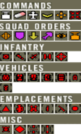

# The Commander

## _Liderando o Squad_ {#leading-the-troops}

A principal tarefa do comandante é ** coordenar ** a equipe e dar orientação e direção àqueles que operam sob seu comando. Sua função é monitorar situações e compromissos e o escopo geral do campo de batalha para determinar efetivamente uma estratégia. Ele também pode conceder ou negar pedidos enviados pelos líderes do esquadrão. Estes incluem relatórios de contato e ataques de área.

** Transmitir diretamente para um Líder de Esquadrão específico ** o comandante pode usar a ** Rede de Rádio de Esquadrão Direto ** usando os dígitos numpad do teclado de 1 a 9 mantendo pressionado o número do esquadrão no teclado numérico.

O Comandante pode ** confirmar ou negar o pedido de ataque de área \(area attack\)**. Se um Líder de Esquadrão solicitar artilharia, o comandante pode clicar com o botão direito do mouse no ícone e aceitá-lo ou negá-lo. Após o qual o pedido será confirmado para a equipe. O ataque da área está disponível a cada 30 minutos. Para os insurgentes e sua greve de morteiros semelhante, normalmente são 20 minutos entre possíveis ataques. Para ver quando artilharia / morteiros estão disponíveis novamente, você pode olhar no canto superior esquerdo da janela do comandante e ver a barra com “** AREA ATTACK **” nela.**

Para manter a equipe coesa, o foco exclusivo do comandante é ** entregar os pedidos ** para cada esquadrão. Ele pode, alternativamente, ajudar os membros da equipe, mantendo-os bem informados sobre situações fora de sua área de operações \(AO\) confirmando inteligência no mapa usando uma variedade de marcadores clicando com o botão direito do mouse no mapa:

* ** Comandos **
  * ** Destroy **: Remova FOBs amigáveis.
  * ** Remove Marker: ** Remova marcadores amigáveis ​​indesejados do mapa.
  * ** UAV: ​​** Implante o reconhecimento de aeronave na posição.
  * ** Waypoint: ** Coloque um marcador de waypoint. Você pode colocar até 7 deles. Cada um é identificado com uma letra. Estes não desaparecem.
  * ** Request Mortars: ** Peça fogo de morteiro a esta posição.
  * ** Target laze: ** Isso gera um objeto de lazer na posição em que foi colocado. Isso pode ser usado pelo CAS para atacar determinados locais.

> 
>
> Possíveis comandos, ordens de esquadrão e comandante de ícones podem usar.

* **Squad Orders**
  * Os mesmos marcadores estão disponíveis para os líderes do esquadrão. Quando você seleciona um esquadrão no menu da esquerda, você pode engajá-los. Se eles aceitarem \(**PAGE UP**\) ele substituirá o marcador desse esquadrão. ****

**Build** 

**Observe**

**Defend** 

**Demolish** 

**Move**

* **Infantry \| Vehicles \| Emplacements \| Misc.**
  * Vários marcadores que podem ser colocados para marcar a infantaria inimiga, ativos e ativos implantados.

Marcadores não podem ser colocados o tempo todo. No canto superior esquerdo há uma barra mostrando “** MARKER **” como você demora até que o próximo marcador possa ser colocado.**

Se os Líderes do Esquadrão acreditam que o Comandante não é eficiente em seus deveres, então eles têm a opção de iniciar um ** motim **. Se for bem sucedido, um novo jogador pode assumir essa posição.**

O ** Commander Rally Point ** pode ser usado por toda a equipe. Para estabelecer este RP o Comandante precisa de pelo menos 6 jogadores perto dele \(um deles deve ser um líder de esquadrão \) para colocar o RP. Este RP não está disponível no modo skirmish e pelo menos 12 jogadores devem estar no time do comandante. O RP permanecerá ativo enquanto o comandante estiver dentro do raio de 100m do ponto de encontro. Todas as outras regras descritas no capítulo Líder de Esquadrão sobre pontos de rally também se aplicam ao ponto de encontro do comandante.

## _UAV_ {#uav}

O Comandante das Forças Convencionais e a milícia são capazes de controlar um ** Veículo Aéreo Não Tripulado \(UAV\) ** do posto de comando de sua equipe ou veículo de comando blindado \(ACV \). O UAV em PR: BF2 não revela automaticamente as posições inimigas, mas dá ao comandante os meios para observar visualmente o campo de batalha do ponto de vista de um olho de pássaro. O comandante pode controlar a câmera do UAV enquanto ele navega a uma altitude constante.

O UAV é lançado colocando o marcador UAV no mapa de comando. Isso pode ser feito pressionando o ícone do UAV no canto superior esquerdo da tela do comandante ou clicando com o botão direito no mapa e colocando o ícone do UAV. Então, para operá-lo, você precisa entrar no veículo ACV na base principal de sua equipe.

> 
>
> Veículo de Comando Blindado.

**O UAV não estará ativo para sempre. ** O UAV perde 0,2% de combustível / seg. Enquanto viaja, 0,1% de combustível / segundo durante a operação e reabastece a 0,2% de combustível / segundo na base. Você pode monitorar o combustível observando a barra “FUEL” no canto superior esquerdo da tela do comandante.**

O UAV pode ser enviado de volta à base a qualquer momento para ** reabastecer **. Voltando à base não consome nenhum combustível. Você pode fazer isso clicando com o botão direito do mouse no ícone do UAV no canto superior esquerdo da tela do comandante.**

O tempo necessário para implantar o UAV depende da distância da viagem. Viaja a 50 m / s.

O UAV leva 45 segundos para iniciar / pousar.

** A câmera UAV ** possui três níveis de ampliação com recursos de visão térmica. O UAV da Milícia oferece apenas dois níveis de zoom sem visão térmica.

O UAV pode ser realocado instantaneamente, atribuindo-lhe uma nova posição no mapa. O UAV opera somente em mapas de 2 km e 4 km, pois é muito poderoso para mapas pequenos.

> 
>
> _A câmera UAV do comandante._

