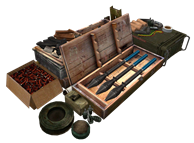

# Game Modes

Project Reality:BF2 possui 6 modos de jogo diferentes com objetivos diferentes. O objetivo comum de todos os modos de jogo é reduzir os pontos de reforço da equipe inimiga \(também conhecido como tickets\) para zero. Na maioria dos modos de jogo, isso é alcançado ferindo e matando inimigos, destruindo seus veículos e capturando seus pontos de controle. Marcadores de mapa coloridos indicam seus objetivos atuais em cada modo de jogo.

PR:BF2 apresenta mais de 50 mapas com mais de 300 camadas diferentes. Você pode encontrar todos os mapas e informações específicas do mapa em [http://www.realitymod.com/mapgallery/](http://www.realitymod.com/mapgallery/).

A maioria dos modos de jogo apresenta variações de 4 camadas com diferentes recursos e suporte disponível. As camadas incluem:

* **Infantry \(16\):** Esta camada geralmente consiste em apenas transporte e veículos armados leves, com foco na luta de infantaria.
* **Alternative \(32\):** Esta é a camada alternativa que apresenta uma diferença grande ou pequena em relação ao padrão.
* **Standard \(64\):** Essa camada geralmente envolve todo o mapa e todos os ativos, conforme aplicável ao mapa. Esta é a camada padrão que pode ser reproduzida em todos os momentos. 
* **Large \(128\):** Essa camada é projetada para rodadas mais longas de 2 horas e geralmente contém todos os ativos da camada padrão com pequenas variações e contagens de passagens mais altas.

## _Advance and Secure \(AAS\)_ {#advance-and-secure}

O modo de jogo AAS é o mais próximo do modo BF2 Conquest original. O objetivo é capturar todos os pontos de controle \(CPs\) enquanto mantém mais tickets que o inimigo. Os CPs só podem ser capturados em uma ordem linear para simular uma linha de frente inconstante e engajar o foco. CPs que estão em jogo para serem capturados são indicados por um marcador de ataque laranja, enquanto aqueles que precisam ser defendidos contra ataques inimigos são destacados com um marcador de defesa roxo. Se o seu time atingir sua última bandeira defensável azul e for capturado pela força adversária, você começará a sangrar tickets até que você recapture sua bandeira pela força. De forma similar, a última força inimigas CP é indicado por um marcador de ataque vermelho e fará com que eles sangrem tickets se sua equipe captura da mesma maneira.

Pelo menos um mínimo de 2 jogadores precisam estar dentro do raio de captura do CP para aproveitar a bandeira. Pode levar mais de um minuto para garantir um CP, dependendo da proporção de atacantes para defensores dentro do raio da bandeira. Embora não seja possível capturar CPs fora de ordem, você pode começar a neutralizar ou capturar o próximo CP antes que o CP atual tenha terminado de capturar / neutralizar, mesmo se você perder outra posição durante o período de captura. Se um CP controlado por uma equipe for neutralizado e capturado pelo inimigo, a equipe perderá 30 tickets. Uma das principais características do AAS é que cada vez que a mesma layout é carregada, pode ser um layout de sinalização diferente, graças aos nossos layouts de sinalização aleatórios.

Se a equipe atacante não tiver uma razão de 2 para 1 para a equipe defensora na bandeira, ela começará a perder o progresso de captura.

Os marcadores de mapa para AAS são:

*  Marcador de Defesa
*  Marcador de Defesa \(com sangramento de tickets\) 
*  Marcador de Ataque
* Marcador de Ataque \(com sangramento de tickets\)

Vehicle Warfare, Skirmish & COOP use similar map markers for attack and defend.

## _Vehicle Warfare \(VW\)_ {#vehicle-warfare}

Muitos veículos pesados lutam pelo controle do mapa neste modo de jogo. Os jogadores estão limitados a Spawnar com kits de tripulação. Apenas kits de oficial e piloto podem ser solicitados. Os ingressos são influenciados apenas por quantos CPs uma equipe controla. Veículos que já estão destruídos reaparecem após 5 minutos. Leva pelo menos 6 jogadores\(dentro de veículos\) para assumir o controle de um CP. A captura funciona muito mais rápido que no AAS.

## _Skirmish_ {#skirmish}

Este modo de jogo opera em versões de mapa de menor escala do modo de jogo Avançado e Seguro, destinado a cerca de 12 a 16 jogadores. É perfeito para jogos de clã e pequenos compromissos de infantaria. O Skirmish tem as mesmas regras que o AAS, mas com zonas de combate menores, geralmente sem veículos ou ativos implementáveis, bem como menos tickets. Se um time perder um PC para o inimigo, ele será penalizado com 10 tíquetes.

## _Command & Control \(CNC\)_ {#command-and-control}

Este modo de jogo apresenta grandes batalhas de forma livre. Não há CPs capturáveis, mas cada equipe deve colocar uma única base operacional avançada \(FOB\) [\(veja estruturas implementáveis\)](the_squad_leader.md#deployable-structures)  
em algum lugar no mapa. O objetivo é defender o FOB da equipe ao tentar encontrar e destruir o inimigo FOB. Quando uma equipe perde sua FOB, ela sofrerá uma penalidade de tickets enorme e continuará perdendo tickets até construir uma nova. O FOB deve ser colocado a pelo menos 200m das bordas do mapa. Construir a FOB da sua equipe mais perto do centro do mapa aumenta a perda de tickets que o inimigo sofrerá enquanto sua FOB estiver inoperante. Ambas as equipes podem construir mais defesas em um raio maior perto de sua FOB do que em outros modos de jogo.

## _Co-Operative \(COOP\)_ {#co-operative}

Neste modo, é possível que um ou mais jogadores humanos entrem em combate ao lado e contra bots controlados por IA. Este modo é ideal para praticar com equipamentos e veículos antes de usá-los em batalhas em larga escala com jogadores humanos. Para acomodar o uso de bots, algumas regras e itens foram modificados neste modo. A maioria dos nossos mapas tem camadas COOP dedicadas.

## _Insurgency \(INS\)_ {#insurgency}

Este modo é muito original em comparação com outros dentro do PR. O objetivo da força de coalizão é encontrar e destruir cinco esconderijos de armas insurgentes escondidos em todo o mapa antes de ficar sem tickets. As forças da coalizão perdem tickets para cada morte de jogador ou ativo destruído, enquanto a equipe de insurgência só perde tickets quando um esconderijo de armas é destruído.

> 
>
> Um cache de armas

As tropas da Coalizão são obrigadas a coletar inteligência matando combatentes insurgentes ou capturando civis insurgentes [\(veja o civil\)](the_civilian.md)  
. Para capturar um civil, um jogador da Coalizão deve estar a menos de um metro do civil e deve usar um limitador, que consiste em um par de algemas de plástico ziptie, acessível selecionando o número 1 no seu teclado ou ** usando uma espingarda ** Isso simula a imobilização do civil com um chumbo de borracha. A coalizão vence se eles conseguirem destruir uma certa quantidade de caches de armas antes de ficarem sem tempo ou sem tickets, caso contrário, a equipe insurgente vence o jogo. Engenheiros Insurgentes também podem reparar caches danificados. A quantidade de caches é mostrada no carregamento do mapa e com mensagens de rolagem no servidor.

Para revelar a localização aproximada dos esconderijos de armas insurgentes enquanto se joga a Insurgência, a inteligência precisa ser reunida pelas forças da coalizão. A equipe da Coalizão precisa de 50 pontos de inteligência \(IP\) para que o cache se revele após 5 minutos. A lista a seguir mostra a quantidade de pontos de inteligência ganhos ou perdidos devido a diferentes ações.

* Insurgent Morto: +1 IP \(dentro de 300m\)
* Civilian or insurgent preso: +10 IP
* Civilian Morto \(violando regras de engajamento\): -5 IP
* Destruindo veículos com civis perto \(Dentro de 50m pelos ultimos 60 seconds\) : -50 IP
* Destruindo veículos civis não utilizados : -5 IP

Jatos, tanques e helicópteros não podem ganhar IP através destes métodos. A localização aproximada do primeiro cache é mostrada cerca de 5 minutos na rodada. Locais adicionais serão revelados 5 minutos após o IP suficiente ser obtido pela coalizão. Pode haver até 2 caches ativos ao mesmo tempo. O novo local é revelado ao atingir 50 pontos de inteligência. Se houver menos de 32 jogadores no servidor, o IP necessário para revelar um cache é reduzido pela metade. Uma equipe pode ter no máximo 50 e no mínimo -50 IP.

Os marcadores do mapa para a insurgência são:

*  **Known Coalition Weapons Cache:** Esse ícone ficará visível no mapa das forças da coalizão, que indica a localização aproximada do cache quando uma inteligência suficiente foi adquirida. O marcador pode ser compensado até 75m.
*  **Known Insurgent Weapons Cache:** Este ícone será visível no mapa das forças insurgentes que indica que o cache foi localizado pelas forças de coalizão.
*  **Unknown Insurgent Weapons Cache:** Este ícone representará a posição do cache onde ele irá aparecer no campo de batalha. Eles são visíveis apenas para as forças insurgentes, para que possam coordenar suas defesas, enquanto as forças da coalizão coletam informações. O cache não será fisicamente gerado até que seja revelado às forças da coalizão.

Os caches podem ser destruídos por pacotes pequenos ou grandes de C4. Outro armamento só causará dano leve ou nenhum dano a um cache.

Uma vez destruído, a equipe da coalizão ganha 30 tickets e uma mensagem informará a equipe sobre quantos depósitos ainda serão destruídos. Caches podem ser reparados por chave ou pás.

Os caches só serão mostrados no mapa 30 segundos antes do início da rodada para evitar a exploração antecipada desta informação.

