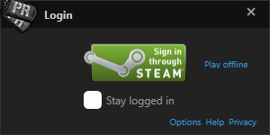
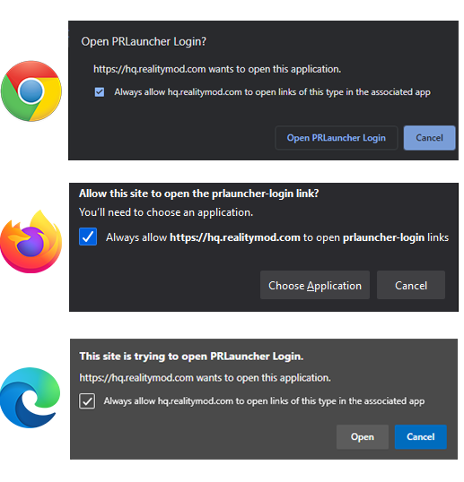
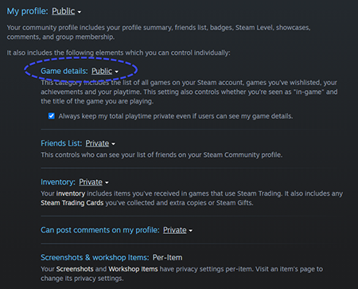
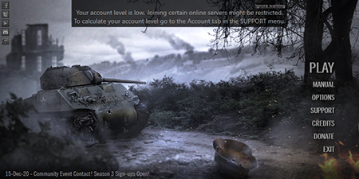
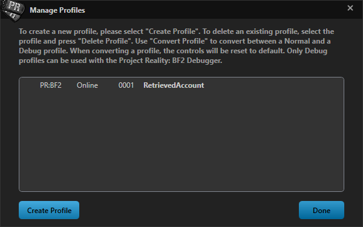
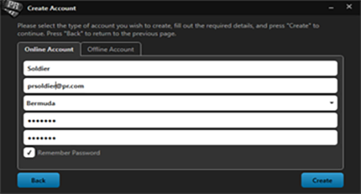

# Set-Up

## _Requisitos do Sistema_ {#systemreq}

* **Sistema operacional:** Windows 7, 8 ou 10
* **Processador:** mínimo de 2.4 Ghz Dual-Core. 3,2 Ghz Recomendado
* **Memória:** 3 GB de RAM. 4 GB recomendado
* **Disco Rígido:** 10 GB de espaço livre no Disco Rígido
* **Adaptador gráfico:** Placa gráfica com 128 MB de RAM. 512 MB recomendados.
* **Som:** Dispositivo de som compatível com DirectX 9. Placa de som dedicada com suporte EAX recomendada para melhor experiência.
* **Internet:** 256 kbps ou conexão mais rápida necessária para jogar on-line
* **Software:** .NET Framework 4
* **Entrada:** Mouse, Teclado
* **Opcional:** Joystick, fone de ouvido, microfone \(altamente recomendado para comunicação de voz \)

## _Instalação do Jogo_                                                                          {#game-installation}

Com o PR: BF2, **não é mais necessário ter o Battlefield 2** instalado. PR: BF2 v1.3 e além funciona como um jogo autônomo. Se você tem uma versão do PR: BF2 instalado, você precisará desinstalá-lo antes de instalar o PR: BF2 v1.6. **Não há patch disponível e versão mais antiga para v1.3!**

Você tem que baixar o PR completo: instalador BF2 do nosso site. Não será necessário ter o Battlefield 2 instalado.

[**Download Full PR:BF2 v1.6 Installer**](http://www.realitymod.com/downloads)

Existem 2 métodos de instalação. Você pode usar o **aplicativo Assistente de Download**, o que torna muito mais fácil instalar o PR: BF2 ou você pode baixar e instalar manualmente o Instalador através de um **Torrent**. Com ambos os métodos, existem 2 etapas: Download e instalação:

**1\) Download**

O Assistente de Download baixará o Instalador usando o protocolo Torrent. Portanto, verifique se isso não está bloqueado pelo seu provedor. Simplesmente baixe o Download Assistant do nosso [PR:BF2 Download Section](http://www.realitymod.com/downloads) e siga as instruções no aplicativo. Se você estiver em uma versão recente do Windows, ele oferecerá um simples botão para iniciar o instalador. Se você estiver em uma versão mais antiga do Windows, não será. Então você será solicitado a ir para a Etapa 2 e seguir as instruções para instalar o PR: BF2.

Se você baixou a versão Torrent \(e agora o Download Assistant \), esta **NÃO** é a instalação completa. Você usa o pequeno arquivo .torrent com um cliente BitTorrent para baixar o arquivo .iso completo. Nós recomendamos [qBittorrent](http://www.qbittorrent.org/download.php). Uma vez que o torrent é baixado através do seu software Torrent selecionado, você será presenteado com um arquivo "ISO" para passar para a etapa 2 depois que o aplicativo terminar o download.

**2\) Instalação**

Se estiver usando o assistente de download em uma versão moderna do windows \(Windows 8 e posterior \), você pode pular esta etapa. O download vem na forma de um “[ISO](http://en.wikipedia.org/wiki/ISO_image)”-file. Sua melhor opção é extrair o arquivo ISO usando software livre como [7-Zip](http://www.7-zip.org/) ou [WinRar](http://www.rarlab.com/).

Mais alguns pontos:

* Com a nova versão independente, também não há mais a necessidade de instalá-lo na pasta Battlefield 2. Sinta-se à vontade para instalar o PR: BF2 em uma unidade e pasta de sua escolha.
* Se você tiver o BF2 instalado, você pode continuar a executa-lo e fazer outras modificações no BF2. PR: BF2 não interfere com eles.
* PR: BF2 possui **um atualizador automático.** Então, depois de instalar o PR: BF2, você pode usar o atualizador para atualizar automaticamente seu jogo para versões mais novas quando elas forem liberadas.
* PR: BF2 v1.3 e além inclui PR Mumble em sua instalação. Portanto, não há necessidade de fazer o download separadamente.
* Se você não quiser usar o Torrents, encontrará espelhos para downloads HTTP diretos em nossos fóruns.

## _Creating a PR Account_ {#creating-a-pr-account}

Since DICE and EA removed support for BF2 in May 2014 we now use our own account-service for PR:BF2. All your old BF2 accounts (before PR:BF2 v1.2) are no longer retrievable. Before using the PR Launcher you will need to create a PR Account in order to play online. This account is unique to you. Offline play does not require a PR Account. We use third-party services to connect and verify a PR Account with. Currently we only support Steam. You will need to have an existing Steam account or [create a new one](https://steamcommunity.com/) in order to link to your PR Account. 
When you launch Project Reality:BF2 for the first time you will shown the following window:

Press the Steam sign-in button to open a webpage where you will need to login to Steam in order to proceed. You will be then asked by your web browser to allow the PR Launcher to login. Depending on your browser this will look similar to the images below. Press the button that allows you to proceed. Afterwards you can close the webpage. 

Your PR Account will be assigned a PR Account Level. This level determines how much your account is deemed legitimate and not a throwaway account. Servers have the option to choose which minimum level is required to play on their server. In order to determine your PR Account Level, your Steam account will need to be made partially public. You can do this in [the Privacy Settings of Steam](https://steamcommunity.com/my/edit/settings). 
Please make sure the _game details_ settings are set to be public. 

**Your Steam profile does not have to be public while playing PR:BF2.** Only when calculating the PR Account level. This is done once automatically on the first login and afterwards only when manually calculating.  You can find our privacy-notice [here](https://hq.realitymod.com/account/privacy.html). If your account level is not high enough to play on most online servers you will be shown a warning on the main PR Launcher screen which looks like the image below.

To recalculate your PR Account Level go to the **SUPPORT** menu and open the _Account_ tab. There you can find your unique PR Account ID as well as your current PR Account Level and a button to calculate it again. Your level can never become lower after calculation. You will always keep the highest level you have. 

Your PR Account Level will be higher by gathering XP for a few indicators. These are for example having no current Steam VAC bans, having games bought on the Steam store in your library and having playtime on said games. **Donations to the Project Reality team do not influence your PR Account Level.**

If you do not wish to create a PR Account to play online, you can choose to play offline only on the initial login screen. 

## _Creating a Profile_ {#creating-a-profile}

You have one PR Account that is unique. However, you can create multiple profiles under this PR Account. Each profile has a unique in-game name as well as separate settings and controls saved on your computer. You can retrieve previously created profiles as well. Older profiles created after PR:BF2 v1.2 and before v1.6 can be retrieved as well by providing the profile name and password. 

You can access the profile settings by hovering over the PLAY button in the PR Launcher and choosing _Select Profile_ and then _Manage Profiles_. You have the option to create offline profiles as well. If you didn’t log in through your online PR Account, you can only make and use offline profiles. 

## _O Launcher de PR_ {#the-pr-launcher}

Após a instalação, um atalho para o Project Reality: BF2 v1.6 será fornecido na área de trabalho, clique duas vezes neste ícone para abrir o Launcher. Quando o Launcher aparecer, você será saudado com uma configuração de perfil de jogador, aqui você pode criar uma nova conta, recuperar ou importar um perfil pré-existente de jogador de RP. Para importar seu perfil, selecione o perfil desejado na lista e clique em importar. Como a DICE e a EA removeram o suporte para o BF2 em maio de 2014, agora usamos nosso próprio serviço de conta para o PR: BF2. Todas as suas antigas contas BF2 \(antes de PR: BF2 v1.2 \) não são mais recuperáveis. Compartilhamos nosso serviço de conta com a modificação do Forgotten Hope 2 para o BF2.

Se você é novo no BF2: PR e nunca fez um perfil antes, basta clicar em "Criar nova conta" e preencher os detalhes necessários e escolher um nome de usuário sensato e fácil de pronunciar. Para jogar em servidores multiplayer PR você precisa criar um perfil online. Você pode criar um perfil off-line, se preferir.

Depois de criar um perfil e fazer o login, você é apresentado ao menu principal do Launcher de relações públicas. Todas as opções são exibidas à direita.

* **Jogar:** Isso iniciará o jogo. Se você clicar na seta para baixo à direita, terá a opção de verificar atualizações ou selecionar um perfil diferente. Se houver uma atualização, ela será exibida automaticamente se você pressionar o botão de reprodução. Essa atualização será baixada e instalada automaticamente. O progresso da atualização e instalação será exibido enquanto estiver em operação.
* **Opções:** Neste menu você pode editar suas configurações de vídeo, gráficos e áudio. Além disso, outras opções estão disponíveis, além de configurar as chaves do PR Mumble.
* **Suporte:** Isso é útil quando você está com problemas. Ele oferece muitos utilitários, como limpar pastas armazenadas em cache ou fornecer uma exibição detalhada das informações do computador. Isso é útil ao entrar em contato com nossa equipe de suporte.
* **Créditos:** Aqui você pode ver toda a equipe do PR: BF2 que trabalhou neste mod por muitos anos.
* **Doar:** Um link direto para a nossa página de doações on-line.
* **Sair:** Use este botão para fechar o PR Launcher e retornar ao Windows

> _O menu principal do launcher também fornece um marcador de notícias na parte inferior destacado em azul com anúncios de eventos futuros, progresso de desenvolvimento e blogs de desenvolvedores da comunidade PR: BF2._

## _Navegação no menu no Jogo_ {#in-game-menu-navigation}

* **Cooperativo:** Permite que você jogue PR: BF2 com soldados de IA controlados por computador. Este modo é muito útil para conhecer a mecânica do jogo e o equipamento antes de entrar em batalhas competitivas online.
* **Multijogador:** O principal modo de jogo no Project Reality. Aqui você encontrará batalhas intensas com até 100 jogadores humanos.
* **Replays:** Este menu dá acesso a replays usando o Battlerecorder.
* **Opções:** Aqui você pode configurar as opções de áudio, bem como o layout do teclado. As opções de vídeo devem ser alteradas no PR Launcher.
* **Sair:** Use este botão para sair do jogo e retornar ao Windows.

## _PR Mumble_                                                                                {#pr-mumble}

No jogo, Mumble é o programa que usamos para nos comunicarmos em PR: BF2, que substitui o Voice-Over-IP do BF2 original. \(VOIP\) sistema. A principal característica exclusiva do PR Mumble é que seu principal método de comunicação é transmitido dentro do espaço 3D, que é baseado em direção e proximidade. Isso é chamado local. O que isto significa é que todos os jogadores da sua equipe podem falar uns com os outros se eles estão por perto, e você pode ouvir em que direção eles estão falando, da mesma forma você pode julgar a que distância eles estão, assim como na vida real.

Depois de se juntar a um esquadrão, você ganha acesso ao Radio do esquadrão, que permite que você transmita para outros jogadores em seu esquadrão, não importa onde você esteja no mapa. Líderes de esquadra também têm acesso a um Radio adicional que lhes permite se comunicar diretamente com o comandante, globalmente para todos os outros líderes de esquadrão, e diretamente para um líder de esquadrão individual. Ao usar um rádio, uma sugestão de transmissão será ouvida ao ativar e desativar o rádio \(que pode ser ativado nas opções de áudio do lançador\). As chaves padrão para transmissão de mensagens são as seguintes:

* **Radio Local \(H\):** você fala com os jogadores no espaço do raio 3D ao seu redor.
* **Radio do Esquadrão \(Num 0\):** você fala com o seu esquadrão, não importa onde você esteja.
* **Radio Lider de Esquadrão para outros Lideres de esquadrão \(\*\):** você fala com todos os líderes do esquadrão ao mesmo tempo. Este rádio também está disponível para o comandante usar com o mesmo atalho.
* **Radio Lider de Esquadrão para outro Lider de esquadrão específico 9\):** você fala com um líder de esquadrão específico em sua equipe. Esses canais na de rádio também estão disponíveis para o comandante usar com o mesmo atalho.
* **Radio Lider de Esquadrão para Commander \(/\):** você fala com o comandante em particular.

O PR Mumble vem instalado junto com o PR: BF2. Ele é executado ao lado da instalação do jogo e faz todas as tarefas do lado do cliente automaticamente para você, como iniciar e conectar você ao servidor mumble certo. Os jogadores têm a opção de configurar suas configurações de comunicação para sua satisfação, assim como a versão anterior. Isso inclui dispositivos de entrada e saída, volumes e atalhos de teclado. As duas chaves mais importantes são padrão: canal local \(H\) e rádio do esquadrão \(0 no numpad\).Os atalhos de teclado principais podem ser editados no PR Launcher e também através do menu de opções na aba PR Mumble.

É recomendável que você também verifique o painel de configurações principais diretamente no aplicativo de mensagens para verificar se tudo está configurado corretamente. Para fazer isso, localize os Dogtags PR na bandeja do sistema ao lado do relógio do sistema Windows. \(PR tem que estar em execução\), clique no ícone para abrir a interface do mumble e localize as configurações no topo. Depois disso, o painel de configurações aparecerá e você poderá configurar seus dispositivos de áudio de entrada e saída e alterar mais atalhos de teclado e outras configurações.

O PR Mumble também se integra ao display HUD do BF2. Durante o jogo, você verá os nomes dos jogadores conversando, cada cor representando o canal que eles estão falando, que é exibido no canto inferior esquerdo da tela. No canto inferior direito, mumble também indica sobre o canal que você está conversando com uma cor diferente, dependendo do canal que você está usando. Ele também mostra se seu microfone ou alto-falantes estão sem som e se há problemas de conexão com o cliente mumble.

Transmissão de Microfone / Alto-Falante / Silenciado / Desconectado

## _Solução de problemas_ {#troubleshooting}

* PR: BF2 tem sua própria verificação de arquivo antes de você iniciar o jogo. Você não poderá jogar online com arquivos modificados. Você ainda pode usá-los offline.
* PR: O BF2 precisa ser iniciado usando o PR Launcher. Iniciar o BF2.EXE ou PRBF2.EXE não funcionará.
* Além do navegador do servidor integrado, você pode usar o [PRSpy](http://realitymodfiles.com/geze/prspy/) para navegar e participar de servidores PR: BF2. O PRSpy também possui uma lista de amigos que facilita muito a localização de seus amigos.

Link direto para o PRSpy : [http://www.realitymod.com/prspy/](http://www.realitymod.com/prspy/)

* Se o servidor que você deseja ingressar estiver cheio, agora você tem a opção de usar o Auto Deploy. Selecione o servidor, clique em “SERVER INFO” e depois em “ENTRAR AUTO”. Uma caixa de diálogo será aberta explicando as etapas restantes. Em seguida, simplesmente deite-se e espere para se conectar uma vez que um espaço se abra.
* O menu de suporte no PR Launcher pode ser muito útil. Pode reunir todas as informações do sistema do seu computador para você copiar e colar em nossos fóruns de suporte para quando você precisar de assistência. Ele também pode fornecer o seu CD-Key Hash.

Aqui estão alguns links de fórum do realitymod.com para usar por vários motivos comuns:

* [PR:BF2 Bugs](http://www.realitymod.com/forum/f26-pr-bf2-bugs) sub-fórum para reportar bugs.
* [PR:BF2 Feedback](http://www.realitymod.com/forum/f252-pr-bf2-feedback) sub-fórum para relatar sua experiênciai sobre PR: BF2.
* [PR:BF2 Support](http://www.realitymod.com/forum/f27-pr-bf2-support) fóruns para todos os seus problemas relativos à execução e instalação do jogo e erros que você está recebendo.
* [General Technical Support](http://www.realitymod.com/forum/f360-general-technical-support) para todas as suas questões técnicas.
* [PR In-Game Tactics and Strategies](http://www.realitymod.com/forum/f137-pr-game-tactics-strategies) irá ajudá-lo ainda mais neste manual para dominar todos os elementos do PR: BF2 com guias e tutoriais escritos pela comunidade.

## _Padrão de Controles do Jogo_ {#default-game-controls}

**Controles Gerais**

| Caps Lock/Home | Seleção de kit, seleção de esquadrão e menus do mapa |
| --- | --- |
| **Tab** | Mostrar placar |
| **Print Screen** | Tirar captura de tela |
| **M** | Mostrar / ocultar sobreposição de mapas |
| **N** | Mudar o nível de zoom do minimap |
| **Q** | Exibir radio de atalhos principal|
| **T** | Exibir rádio de atalhos secundário |
| **Alt esquerdo** | Mostrar / ocultar marcadores 3D \(visível apenas dentro de 50m\) |
| **C** | Alternar câmera BUIS / Alterar câmera |
| **End/grave** | Console |

**Armas**

| **G** | Pegar / Trocar / Largar um kit |
| :--- | :--- |
| **Botão Esquerdo do Mouse** | Atirar |
| **Botão Direito do Mouse** | Mirar |
| **R** | Recarregar |
| **F** | Mudar para o proximo Armamento |
| **1-9** | Selecionar Armas |

**Movimento**

| **E** | Entrar / Sair de veículo ou Construção |
| --- | --- |
| **WSAD** | Movimentação básica |
| **Left Ctrl** | Agachar \(Segurar\) |
| **Z** | Alternar deitar |
| **Space** | Pular |
| **Left Shift** | Correr / Impulsionamento extra do Veículo |

**Veículos**

| **F1-F8** | Trocar Posição do Veículo |
| --- | --- |
| **X** | Aumentar a ampliação do zoom / flares |
| **6-9** | Posições da Câmera \(helicópteros e Aviões apenas\) |
| **R** | Recarregar |
| **F** | Mudar para o proximo Armamento |
| **1-9** | Selecionar Armas |

**Comunicação**

| **J** | Bate-papo para todos os jogadores |
| --- | --- |
| **K** | Bate-papo somente para sua equipe |
| **L** | Bate-papo apenas para o seu esquadrão |
| **Page Up** | Aceitar pedido |
| **Page Down** | Negar pedido |
| **B / H** | PR Mumble Canal de radio local |
| **V / 0 \(numpad\)** | PR Mumble Canal de radio do Esquadrão |
| **1-9 \(numpad\)** | PR Mumble Canal de Rádio de um Líder de Esquadrão Individual |
| **\*\(numpad\)** | PR Mumble Canal para Todos os Lideres de Esquadrão |
| **/\(numpad\)** | PR Mumble Canal de rádio Individual com o comandante|

**Mumble Atalhos**

