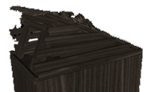
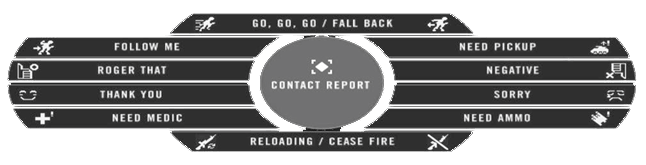
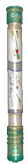
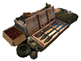
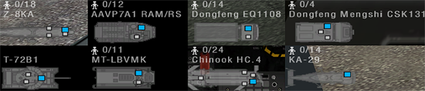

# O Básico

O  mais importante, você deve **juntar-se a um esquadrão**. Alguns servidores até reforçam, kickando jogadores sem squad após um período de aviso. O jogo é de longe mais divertido de se jogar em um esquadrão funcional. Se você precisar de ajuda, apenas **pergunte aos jogadores do seu esquadrão** o que fazer. Se possível, use o Mumble. É comumente usado em partidas online. Jogar PR:BF2 sem microfone não lhe dará a experiência completa, por isso é um investimento inteligente. Se ninguém responder, tente entrar em outro esquadrão ou use o chat geral. Há muitos membros da comunidade em atividade que recebem novos jogadores e dão uma ajuda. Esperamos que você tenha uma compreensão básica do BF2 quando se trata de navegar pelo menu do jogo, como placar, mapa e kit. Você sempre pode inicializar o BF2 e fazer o tutorial para se familiarizar com sua interface. Este manual irá focar nas diferenças com o BF2.

## _Seleção de Kits e como Spawnar_ {#kit-selection-and-spawning}

* Quando você começar a jogar, é recomendável que você só spawne como um rifleman com uma mira de sua escolha. Desta forma, você pode aprender melhor os fundamentos básicos do jogo.
* Depois de aprender os fundamentos da infantaria, você pode pedir ao seu SL \(Squad Leader\) para lhe atribuir um kit especializado quando se sentir à altura da tarefa. Se você quiser experimentar um novo equipamento ou um veículo, pode fazê-lo facilmente no modo cooperativo sem incomodar seus membros do esquadrão ou arriscar os asssets  \(Veiculos\) e construções especializados \(citados no texto abaixo\) de sua equipe.
* Os kits especializados e mais difíceis de operar geralmente são limitados e só podem ser obtidos se determinadas condições forem atendidas em um esquadrão. Esses kits reservados são de suprimento limitado para a equipe e você deve sempre perguntar antes de solicitar um.
* Kits podem ser solicitados no menu principal de spawn \(Estilo BF2\), uma caixa de suprimentos [\(Ver Logísticas\)](the_basics.md#logistics) ou a parte traseira de um APC / IFV. Para ter a capacidade de solicitar um kit de uma caixa ou veículo, você deve fazer parte de um esquadrão.

Em PR:BF2 você não pode spawnar em todos os pontos de controle que sua equipe controla. Pontos de Spawn disponíveis no PR:BF2 são:

* **Rally Point ou RP** é um círculo verde em torno de um ponto de spawn com o número do seu esquadrão ao lado. Dependendo da localização do Rally do seu esquadrão em relação a FOB de uma equipe, ele determinará seu tempo de duração. Nota: Se você aparecer no ponto de rally de outro esquadrão, você irá automaticamente aparecer no seu próprio ponto de rally, ou em qualquer FOB próxima. Se não houver nenhum disponível, você será transferido para a base principal de sua equipe. Se for invadido pelo inimigo, o Rally do seu esquadrão desaparecerá. Rallys só estão disponíveis para forças convencionais. [\(veja estruturas implementáveis\)](the_squad_leader.md#deployable-structures)

> 
>Um rallypoint.

* **Rallypoints de Equipe especificos do mapa**. Estes geralmente expiram 5 minutos após o início da rodada e podem ser usados por toda a equipe. Estes também só permitem que o máximo de 12 pessoas spawnem até que desapareça.
* **O Rallypoint do Comandante**. Esse Rally só pode ser colocado pelo comandante, desde que os líderes de vários esquadrões estejam nas proximidades do Comandante. No mapa, esse será um ponto de reunião com um "C" ao lado dele.
* **Base operacional avançada implantável \(FOB\) ou hideouts** podem ser usados por toda a equipe para spawnar, mas devem ser construídos antes de se tornar operacional. No mapa, ele aparecerá como um ponto de spawn com um triângulo verde. Ele fica online 90 segundos depois de ser construído. Ele se torna inviolável por 30 segundos se 1 inimigo estiver a 10 m, 2 inimigos em 50 m, 4 inimigos em 100 m ou 8 inimigos em 150 m. [\(veja estruturas implementáveis\)](the_squad_leader.md#deployable-structures)
* No modo de jogo de insurgency, a equipe rebelde defensora pode aparecer nos **caches** que não foram revelados ao inimigo, isso é chamado de cache desconhecido. Este spawn também é desativado se inimigos se aproximarem do cache.

> 
>
> FOB, Hideout e um Cache.

* **A sede da sua equipe, base principal, FOB permanente ou main base;** Este é o único ponto de spawn que está sempre disponível.

> 
>
> Veículo de Comando Blindado \(ACV\) encontrado apenas em bases principais.

* Alguns mapas apresentam **parachute spawns**, spawns de pára-quedas onde um ataque aéreo é simulado. Estes serão visualizados como pontos de Spawns se movendo no minimapa. Escolha um e você vai abrir um pára-quedas automaticamente

## _Interface do Jogo \(HUD\)_ {#hud}

* No HUD do PR:BF2, os jogadores são notificados por mensagens **específicas do jogador** que só podem ser vistas por esse jogador. Eles são usados para dar feedback aos jogadores sobre diferentes eventos no jogo, por exemplo:
   * A razão pela qual o jogador não recebe o kit solicitado.
   * A razão pela qual a construção que o player solicitou não pôde ser construída.
   * Que o jogador deve sair do veículo ou do assento atual para evitar punição.
* PR também usa **Notificações HQ**, que é exibido em Laranja na parte superior esquerda da tela. Essas notificações fornecem atualizações sobre os objetivos atuais, o progresso da missão e outras mensagens essenciais.
* O disparo **de mira** foi removido da tela. Se você quiser atirar com precisão, você precisa pressionar a tecla de disparo alternativo para usar a mira da sua arma, ou usar a mira de Backup para lutar de perto. \(veja o capítulo sobre armas\).
* **Tags de nome foram removidas** para todos os jogadores. É vital identificar seus alvos antes de se envolver para evitar um fogo amigo \(Também conhecido como TK\). Aprender a distinguir diferentes camuflagems, bandeiras e perfil da silhueta da infantaria das facções o ajuda a identificar um inimigo mais rapidamente. Como exemplo, para localizar um Líder de Esquadrão, procure uma antena de rádio que se estenda para cima de sua mochila.
* **Nenhuma barra de status de saúde\(Barra de vida\)** indicando seu status vital. Quando você perder mais de 25% de sua saúde, começará a ver uma tela vermelha e sangrenta que pulsa ao ouvir sons de dor de ferimentos. Você continuará perdendo saúde ao sangrar até receber ajuda médica, se não morrer. Se, no entanto, sua saúde cair muito, sua tela perderá todas as cores, sua visão ficará muito embaçada e você não conseguirá se mexer rapidamente. Você terá aproximadamente alguns minutos para chegar à ajuda médica ou morrerá.
* **O contador de munição** exibe apenas o modo de disparo da arma e o número de carregadores \(Pentes de Munição\) restantes.
* Para estimar a **quantidade de munições restantes** em seu pente, você pode abrir a roda de comunicação \(**Q** \) e ver um indicador visual da quantidade de munição deixada. 
* **O Medico** pode ver no HUD um icone de cura ao curar um soldado, este icone aparece no canto inferior direito. A infantaria pode observar da mesma forma quanto tempo até que o tratamento esteja concluído.
* Não há **mensagens de matar** \(fogo amigo é uma exceção\). Mesmo o placar não mostrará quem está vivo ou morto no time inimigo. Se você precisa saber se alguém está morto, você deve procurar por seu corpo.
* Somente veículos usam um **mini-mapa** permanente no HUD. O mapa completo está disponível para todos.
* **O mapa e a layer atual** podem ser visualizados na parte superior da tela ao abrir o mapa.
* Usando a pequena seta, você verá as **informações de todos os veiculos \(Assets\) do mapa atual**, incluindo os tempos de spawn de veículos aliados.

> 
>
> informações de assets do mapa atual.

* **Os tickets restantes** de sua equipe e o tempo restante só podem ser vistos na tela de seleção de kits e de mapa. Os tickets inimigos não são exibidos.
* **Supressão** acontece quando você está sob fogo inimigo, armas pesadas ou explosões próximas. A tela aparecerá mais escura e ficará borrada como se estivesse tremendo. Este efeito simula a capacidade reduzida de retornar fogo efetivo enquanto é suprimido pelo inimigo.

> 
>
> visão normal do jogo \(esquerda\) e efeito de supressão em ação \(direita\).

* Quando um jogador está **morto,** ele não será revivido e a tela preta com as palavras “dead” será exibida em vez de ver o que está ao seu redor.
* Sua arma irá se desviar e se tornar imprecisa para atirar com base na quantidade de movimento que você faz. Para ter uma indicação dessa imprecisão, há um indicador de desvio logo acima da bússola. Quanto mais amplo for esse indicador, mais imprecisa você sua arma será.
* **O sistema automático de comunicar avistamentos \(spots\) no mapa** foi removido da infantaria. Veículos aéreos ainda podem ser vistos.
* Os oficiais \(Officers\) podem enviar um relatório de **contato** para o comandante ou usar seu rádio para colocar manualmente uma marca no mapa da equipe. Soldados normais só podem gritar um aviso genérico quando localizam unidades inimigas.
* **A roda de rádio \(default: Q & T\)** contém itens com duas funções. Clicar com o botão esquerdo **“RECARREGAR / CESSAR FOGO”** diz às pessoas ao seu redor que você está recarregando, enquanto um clique com o botão direito diz a elas para parar com o fogo-amigo. O mesmo princípio se aplica a **“VAI, VAI, VAI / RECUAR!”** e outros itens do menu.
* Você pode **orientar-se** no mapa usando o elemento de direção que você encontrará em torno do ícone do seu jogador.
* Embora equipado com armas ou equipamentos específicos, o menu de comunicação de rádio principal é substituído por um pequeno menu sensível ao contexto. Ao segurar um curativo ou a bolsa de primeiros socorros, você pode usar o comando “PRIMEIROS SOCORROS” para informar aos jogadores próximos que você deseja curá-los. Muitos equipamentos e algumas armas usam menus contextuais.

> 
>
> Menu de Comunicação ao pressionar Q.

## _Gestão dos Pontos de Vida_ {#health-management}

Armas no Project Reality são altamente letais e é apenas uma questão de tempo até você ser baleado e começar a sangrar. Embora o HUD no PR não contenha uma barra de saúde, uma vez que sua saúde fica abaixo de 75%, haverá sinais sonoros e visuais para avisá-lo, como uma visão sangrenta ao tossir ou gritar.

### Cura

Se seus ferimentos não forem tratados, você sangrará lentamente até a morte. Para evitar isso, você tem duas maneiras de se curar. Quase todos os kits incluem um **Curativo \(Também conhecido como Field Dressing, Bandagem ou Pastel\)** que é selecionado pressionando a tecla apropriada ou passando por sua seleção de armas. Pressionar o botão esquerdo do mouse joga o curativo no chão. Dentro de um segundo ou dois, o curativo de campo desaparecerá e o jogador ao lado recuperará 25% de sua saúde total.

Como a maioria dos kits possui apenas um ou dois curativos, a melhor maneira de recuperar a saúde é ser tratado por um médico. **Medicos* são capazes de curar completamente um jogador usando um **Kit de Primeiros socorros \(Medical Supplies\)** e podem ser chamados para a sua posição usando a tecla de rádio “Q” e selecionando “Preciso de Medico \(Need Medic\)”. O médico selecionará o kit de primeiros socorros pressionando a tecla numérica apropriada ou passando por sua seleção de armas. No entanto, ao contrário do BF2, o médico não pode simplesmente jogar o kit de primeiros socorros no chão, mas deve segurá-lo em suas mãos, tocar o jogador a ser curado e, em seguida, pressionar o botão esquerdo do mouse. Um som simulando bandagens sendo rasgadas indicará que os primeiros socorros estão sendo aplicados. Para ser completamente curado leva cerca de 15 segundos, então certifique-se de fazer isso em um local seguro.

> 
>
> Curativo, Kit de primeiros socorros e seringa

### Revivendo

Se você não puder ser curado a tempo, ficará inconsciente e a tela dirá que você foi gravemente ferido \(wounded\). Isso não significa que você está morto! Quando você se torna gravemente ferido, um médico ainda pode revivê-lo por até 5 minutos, economizando tickets valiosos para sua equipe. Você pode utilizar Mumble para coordenar o médico para a sua localização usando o canal local \(H\) ou **o Radio do esquadrão \(0 numpad\).** Para reviver você, o médico seleciona **Seringa \(epipen\)** de sua seleção de arma e com a seringa na mão, injeta e administra o tiro de epinefrina na área de massa central do torso de jogadores inconscientes clicando e mantendo pressionado o botão esquerdo do mouse . O jogador então se tornará consciente, mas ao contrário de BF2, terá apenas 10% de vida e ainda precisará de cura. O médico e o jogador recentemente revivido devem encontrar uma área segura e continuar o processo de cura. Se o jogador estiver preso, em um terreno irregular ou em uma posição ruim para reanimar, é necessário primeiro arrastar o corpo ferido para uma posição melhor. Para arrastar um corpo como médico, você precisa estar agachado e permanecer nele. Então você pode usar o slot de arma de arrastar \(drag\) para começar a arrastar. Você pode arrastar em todas as direções, incluindo para trás.

[Video Tutorial - Reviving](https://www.youtube.com/watch?v=auBgiI8IxWE "Tutorial em video de como Reviver")

### Morte

Às vezes, os jogadores não serão revividos, como quando um jogador é morto em um veículo. Se você foi recentemente revivido e você se torna gravemente ferido novamente dentro de 2 minutos, você não será revivido pela segunda vez. Se você for ferido e não for ressuscitado dentro de 5 minutos, você também morrerá. Se não houver chance de ser ressuscitado, clique em ** Desistir / Chamar Medico \(Give Up / Call Medic\) ** na tela do spawn. Agora a tela mostrará que você está morto e você pode se preparar para respawnar. O tempo que você gasta esperando para clicar em desistir conta para o seu tempo total de reaparecimento.

### Re-spawnando

O tempo de respawn de um jogador é de pelo menos 45 segundos e no máximo 60 segundos nas penalidades temporárias. O tempo gasto enquanto se espera por um médico é subtraído desse tempo. Quando um jogador morre, ele tem que esperar pelo menos 5 segundos antes de spawnar. Estas ações influenciam o tempo de respawn:

* Morte do jogador: **+3s**
* Capturando Bandeira ou destruindo objetivo: **-3s**
* Fazendo uma ação defensiva: **-1s**
* Contrução de uma FOB: **-10s**

Uma penalidade temporária de spawn que afeta somente a próxima vez que você morrer \(somado até 5 minutos\) é adicionado por essas ações:

* Teamkill: **15 segundos por teamkill**
* Suicidio: **15 segundos**
* Capturado como Civil: **90 segundos**
* Matar um Civil violando ROE: **120 segundos por Civil**
* Cache de armas aliado destruído: **300 segundos**

Para selecionar um ponto de spawn, abra o mapa de spawn e selecione um local aplicável. Quando estiver satisfeito com esse local de spawn, você deverá clicar no botão **Pronto** no canto inferior direito da tela do mapa para voltar ao jogo. Apenas esperando o cronômetro expirar ou clicando no botão &lt; Enter &gt; não vai automaticamente reaparecer. Se você vir um número muito grande no timer, como 5999, você não clicou em Pronto.

## _Logística_ {#logistics}

Não importa se você está com pouca munição e precisa se rearmar, quer um novo kit ou simplesmente quer construir algumas Estruturas, a logística mantém sua equipe viva.

### _Munições_ {#ammunition}

Para ser capaz de se rearmar, você precisará se aproximar de uma das várias fontes de munição, que então automaticamente recarregará suas armas. Essas fontes são:

* **Bolsas de Munição \(Ammo bags\)** - Estes podem ser encontrados no rifleman, militante, guerreiro \(rifleman, militant, warrior\) e alguns kits insurgentes e devem ser lançados \(Botão esquerdo do mouse\) no chão, para você ou outros soldados poderem se rearmar, ou em estruturas \(tow, aa, morteiros\) para remuniciar os mesmos. 
* **Caixas de Munição \(Ammo boxe\)** - Derrubado por veículos leves transportados, APCs e IFVs.
* **Caixas de Suprimento \(Supply Crate\)** - Mais informações no [next section](the_basics.md#crates)
* **Caches de armas** - Disponível apenas para insurgentes
* **Depósito de veiculos (informalmente conhecido como reparo)** - Presente em todas as bases principais, também te cura

> 
>
> Bolsa de munição, Caixa de munição das forças da Coalizão, Caixa de munição das forças Insurgentes, Cache de armas e depósito de veículos.

Esteja ciente de que, com exceção de **caches** e ** depósito de veículos \(reparo da base principal\), **todas as outras fontes de munição são **limitadas**. Eventualmente, essas fontes se esgotarão e desaparecerão. É até possível que as fontes de munição se esgotem antes de você ser totalmente rearmado.
**Bolsas de munição **, ** caixas de munição ** e ** caixas de suprimentos ** usam ** pontos de suprimentos ** para determinar por quanto tempo eles podem ser usados. Você pode descobrir os pontos de suprimento restantes de ** caixas de suprimentos ** e ** caixas de munição ** olhando para eles por um segundo. Ele aparecerá ao lado da bússola.
As várias armas disponíveis no PR requerem diferentes quantidades de pontos de abastecimento para serem reabastecidos. Itens utilitários como o gancho\(corda\), tripflares e curativos \(pastel\) custam menos para reabastecer do que munições explosivas, como foguetes / mísseis antitanque, granadas de fragmentação e minas. Veja as tabelas abaixo para o custo de reabastecimento da categoria e tipo de arma correspondente:

**Armas de Fogo**

| **Tipo** | **Custo de pontos de abastecimento** |
| --- | --- |
| **Pistolas de baixa capacidade** | 15 |
| **Pistolas de alta capacidade** | 30 |
| **PDW \(arma de defesa pessoal\)** | 30 |
| **SMG** | 45 |
| **Shotgun primaria** | 50 |
| **Shotgun do breacher** | 25 |
| **Rifle** | 60 |
| **Sniper** | 40 |
| **LMG \(Light Machine Gunner ou Metralhadora leve** | 150 |
| **GPMG \(general-purpose machine gun ou Metralhadora de uso geral\)** | 200 |

**Lançador de Granadas**

| **Tipo** | **Custo de pontos de abastecimento** |
| --- | --- |
| **Anti-Tank x1** | 70 |
| **Anti-Tank x2** | 140 |
| **Flare** | 60 |
| **Fragmentação de baixa capacidade** | 80 |
| **Fragmentação de alta capacidade** | 120 |
| **Granada de fumaça \(Smoke\)** | 60 |

**Items e utilitários**

| **Tipo** | **Custo de pontos de abastecimento** |
| --- | --- |
| **Caixa de munição** | 200 |
| **C4 de baixa capacidade** | 45 |
| **C4 de alta capacidade** | 75 |
| **Tripflare** | 20 |
| **Grappling hook \(corda ou gancho\)** | 40 |
| **Seringa \(Epipen\)** | 60 |
| **Curativo \(Field dressing ou Pastel\) x1** | 30 |
| **Curativo x3** | 75 |
| **Curativo x6** | 120 |
| **Curativo x12** | 180 |

**Artilharia pesada e munições**

| **Tipo** | **Custo de pontos de abastecimento** |
| --- | --- |
| **Granada de Fragmentação x1** | 60 |
| **Granada de Fragmentação x2** | 120 |
| **Granada de Fragmentação x4** | 240 |
| **Granada de Fumaça de baixa capacidade ** | 40 |
| **Granada de Fumaça de alta capacidade** | 60 |
| **Granada de fumaça de sinalização** | 30 |
| **Mina Anti-pessoal x2** | 140 |
| **Mina Anti-pessoal x3** | 210 |
| **Mina convencional** | 210 |
| **Mina insurgente** | 160 |
| **IED leve** | 60 |
| **IED pesada** | 80 |
| **Míssil antiaéreo x1** | 100 |
| **Míssil antiaéreo x2** | 170 |
| **Anti tanque leve x1** | 70 |
| **Anti tanque leve x2** | 140 |
| **Anti tanque leve x3** | 210 |
| **Anti tanque leve x4** | 280 |
| **Anti tanque médio x1** | 80 |
| **Anti tanque médio x2** | 160 |
| **Anti tanque médio x3** | 240 |
| **Anti tanque pesado x1** | 90 |
| **Anti tanque pesado x2** | 180 |
| **Anti tanque guiado** | 120 |

Observe que em um servidor local, o sistema de reabastecimento não funcionará conforme descrito. Cada slot de arma exigirá 100 pontos de suprimento para recarregar, independentemente do tipo de item.

Solicitar um kit custa 200 pontos de suprimento. Esteja ciente de que rearmar uma bolsa de munição em, por exemplo, uma caixa de munição ou caixa de suprimentos leve / pesada custará tantos pontos quanto ela fornece (200).
A quantidade de pontos de abastecimento para as fontes de abastecimento são:

* **Bolsas de munição** : 200 (will only count for 43 supply points when used by an asset emplacement like a TOW or mortar for example)
* **Caixas de munição** : 450
* **Caixa de Suprimentos leve** : 1500
* **Caixa de Suprimentos pesada** : 3000

Outra coisa a notar é que o reabastecimento não é instantâneo, mas leva alguns segundos, dependendo da fonte de munição e também da quantidade de munição que você precisa para ressuprimir. Além disso, se você não estiver rearmando, confirme se as caixas de suprimentos Leves / Pesadas são realmente suas, o rearmamento das caixas de suprimentos inimigas não é possível.

### _Caixas de Suprimentos \(Supply Crates\)_ {#crates}

Existem dois tipos de caixas de suprimento \(Supply crates\) em PR:BF2 - Caixa de Suprimento leve \(light supply\) e Caixa de Suprimento pesada \(Heavy supply\). Enquanto ambos permitem remuniciar os jogadores e construir implementáveis, uma caixa leve é o equivalente a metade da Caixa de Suprimentos Pesada, o que significa que você precisará de duas caixas de suprimento leve onde apenas uma caixa de suprimento pesado é necessária. Para saber mais sobre construções, consulte o capítulo [construiveis.\)](the_squad_leader.md#deployable-structures)

> 
>
> _Aqui você pode ver a  de suprimento pesado à esquerda e a versão leve à direita._

Assim como o rearmamento, a solicitação de kits das caixas esgotará as caixas de suprimentos. Cada kit custará 200 pontos, com caixas leves contendo 1500 \(7x kits\) e pesadas 3000 \(14x kits\).

> Solicitar kits de uma caixa que não tenha pontos suficientes ainda lhe dará o kit, mas a caixa será destruída no processo.

A caixa de supply leve pode ser transportada por:

* Helicópteros leves, como o Huey, Lynx e Zhi-9B \(Uma caixa\)
* Caminhões de transporte \(Uma caixa\)

Enquanto, a caixa de suprimentos pesados pode ser transportada por:

* Helicópteros de Elevação Média, como o Black Hawk, Mi-17 e NH-90 \(Uma caixa\)
* Helicópteros Levantamento pesado, como o Chinook, o Zhi-8KA e o MV-22 \(Duas caixas\)
* Caminhões de transporte: \(Duas caixas\)

A facção da qual a caixa pertence é representada pela exibição da bandeira no topo da caixa.

### Reparo Móvel

Os caminhões de logística também têm a capacidade de soltar uma estação de reparo. Eles são necessários para reparos em campo em veículos que estão muito danificados e não podem se mover\(veiculos trackeados\).

> 
>
> Reparo móvel.

## _Pontuação_ {#score}

A pontuação de um jogador é dividida em pontos de trabalho em equipe e pontos individuais. Ele fala por si mesmo que fazer atividades relacionadas à equipe \(construir, dirigir veículos, defender / atacar bandeiras \) contribui para a primeira e ações individuais \(matar jogadores \) contribuem para sua pontuação pessoal.

A pontuação total de um jogador nunca pode ser inferior a 0, mas a pontuação do trabalho em equipe pode se tornar negativa. Há também multiplicadores de pontuação para quando você está, por exemplo, em um veículo ou um líder de esquadrão. Aqui estão algumas outras adições e deduções de pontuação. Estes não são todos, mas dão uma boa ideia do que você pode alcançar.

* Capturando um civil: **+100**
* Matando um civil \(fora das normas ROE\): **-100**
* Destruindo seu próprio objetivo: **-100**
* Destruindo objetivo inimigo: **+150**

## _Morteiros_ {#mortars}

Uma posição de Morteiros que pode fornecer suporte indireto a longas distâncias. Todas as facções podem disparar balas altamente explosivas. As forças convencionais e a milícia também podem usar balas de fragmentação \(Air-burst\) e fumaça. Morteiros não podem ser o em mapas menores que 2km.

* **High Explosive \(HE\)** \(pressione **1** para selecionar\): Tipo mais comum de Morteiros. Faz o maior dano diretamente ao alvo. Ideal para alvos blindados leves na posição.
* **Airburst\(fragmentação\)** \(pressione **2** para selecionar\): Explode no ar acima do solo. Cobre uma área maior, mas causa menos dano geral. Ideal para envolver a infantaria dentro de edifícios e em terrenos irregulares.

Uma vez que os morteiros são necessários, você pode usar a calculadora \(pressione **3** para selecionar\). A distância até o alvo e a diferença de elevação podem ser inseridas na calculadora, clicando nos números nos campos **“Alcance \(Range\)”** e **“Altura \(Height\)”**. Para obter o intervalo, verifique se o marcador do SL \(Squad Leader\) está no alvo \(posição da mira na bussola\), abra o mapa e você encontrará o intervalo listado abaixo do mapa. Quando terminar, basta clicar no botão **"Calcular \(Calculate\)"** para exibir a elevação do morteiro desejada. A elevação pode ser ajustada com as teclas W e S enquanto a direção é alterada usando as teclas A e D. Quando ambos os valores estiverem definidos, basta selecionar a munição de disparo desejada \(HE, Airburst, smoke...\) e disparar. Há duas rodadas Air-Burst e Impact disponíveis que compartilham munição.

> 
>
> A interface da calculadora do Morteiro.

## _Suporte de Reparação de Pontes \(CSB\)_ {#close-support-bridges}

Quando precisam atravessar pequenos rios ou pontes danificadas, as forças convencionais podem implantar CSBs usando seus caminhões de logística - o que carrega dois deles. No Project Reality, os CSBs só podem ser usados para preencher as lacunas de pontes destruídas e em locais predeterminados identificados por \(óbvios \) pequenos montes de areia posicionados ao longo de um obstáculo natural, como um rio.

> Os CSBs são muito estreitos, por isso dirija com cuidado quando os cruzar.

O processo de implantação de CSBs é muito simples: 1. Direcionar um caminhão de logística para a posição em que o CSB será implantado. 2. Posicione a parte dianteira ou traseira do caminhão o mais próximo possível da posição de desdobramento. 3. Selecione o CSB como equipamento ativo do caminhão. 4. Pressione botão direito do mouse para implantar a ponte.

[Video Tutorial - CSB Deployment](https://www.youtube.com/watch?v=Vn66KbNrVJA "Video Tutorial - CSB Deployment")

> 
>
> CSB do caminhão sendo implantado.

Em alguns casos, vários CSBs são necessários para abranger a distância completa. Em tais situações, você é obrigado a dirigir até o final da ponte incompleta e implantar um novo CSB e repetir até o final.

## _Navegação do Campo de Batalha_ {#battlefield-navigation}

É muito fácil se perder nos grandes mapas do PR: BF2. O ritmo lento e a coordenação da equipe também exigem que os jogadores comuniquem os locais de maneira clara e concisa. PR: BF2 oferece 4 ferramentas para ajudar os jogadores com isso.

1. Líderes de esquadrão podem usar seu **marcador de ordem de esquadra** para comunicar locais ao seu esquadrão e ao comandante. A direção do marcador é indicada por uma divisa acima da bússola. Se você estiver a 75 m do marcador, também verá um ícone 3D que mostra a localização à sua frente. O marcador também será visível no mapa.
   * **Alvo** 
   * **Construir** 
   * **Observar**
   * **Defender**
   * **Demolir** 
   * **Mover**
2. Uma **bússola de grau de precisão** na área central inferior da tela. A bússola pode ser usada para dar os rolamentos exatos de inimigos marcados próximos. **Os 8 pontos cardeais** estão claramente indicados juntamente com os rótulos dos rolamentos que aumentam gradualmente a cada 15 ° com grandes divisões a cada 5 °. Se você quer apenas comunicar uma direção geral, é melhor dizer a direção cardeal, seguida do grau e, em algumas situações, da distância, se apropriado. Por exemplo, _ **“Inimigo visto a NE a 75 ° graus a 200 metros”**.
  * Se o alvo estiver visualmente alinhado com um rolamento numerado na sua bússola quando você estiver voltado para essa direção, basta comunicar esse número.
    * Lembre-se de que todos os entalhes grandes da bússola são iguais a 5 graus. Se o alvo estiver alinhado com um entalhe à direita de um entalhe marcado ao longo de 75 °, então à direita você adiciona 5 °. Então o alvo está a 80 °!.
3. Os mapas em PR:BF2 contêm **rótulos de referência de grade e sub-redes de teclado**. Os rótulos de grade são encontrados na borda superior e esquerda do mapa. O mapa é dividido em 169 quadrados de grade começando com A1 no canto superior esquerdo e terminando com M13 no canto inferior direito. Cada quadrado da grade é dividido em 9 sub-redes. Aqueles são rotulados de 1 a 9 da mesma maneira que o numpad do computador é organizado. \(Linha superior da esquerda para a direita 7, 8, 9\). Você pode comunicar locais fornecendo uma referência de grade. Para um local aproximado, você diz apenas o campo da grade principal \(por exemplo, D6\). Para locais precisos, você também adiciona o local da sub-rede \(por exemplo, D6-2\). As referências de grade são usadas principalmente para comunicar locais entre os esquadrões. Ao usar Mumble, a primeira letra da referência Grid é normalmente anunciada usando o alfabeto fonético da OTAN. As palavras de código são Alpha, Bravo, Charlie, Delta, Echo, Foxtrot, Golf, Hotel, India, Juliett, Kilo, Lima, Mike, November, Oscar, Papa, Quebec, Romeo, Sierra, Tango, Uniform, Victor, Whiskey, X-ray, Yankee and Zulu
4. **A escala de cada quadrícula** quadrada é exibida no canto inferior direito do mapa. Um mapa de 1 km será indicado por um quadrante de 75 metros, 150 metros por 2 km e 300 metros por um mapa de 4 km. Você pode estimar facilmente as distâncias no mapa usando os quadrados da grade. A tela de esquadrões do líder de esquadra também exibe a distância aproximada de seu marcador de esquadrão atual abaixo do mapa do campo de batalha.  

## _Informações Básicas de Veículos_ {#basic-vehicle-information}

Muitos veículos se comportam de maneira bastante diferente em relação ao BF2 e exigem conhecimentos mais avançados para operar. Como eles também têm tempos de spawn muito longos (até 20 minutos), é vital saber como mantê-los longe de situações problemáticas. Esta parte vai se concentrar em explicar os tipos de veículos e como eles influenciam a equipe. Para mais detalhes sobre a operação de veículos, consulte este manual na seção Veículos de Operação.

Existem muitos tipos de veículos em PR:BF2 usado como classificação. Isso nem sempre está diretamente de acordo com a contraparte da vida real devido a razões de jogabilidade. A lista a seguir mostra as principais classes de veículos em PR: BF2:

* **Jeep:** pequenos veículos de transporte que nem sempre preenchem toda a equipe. Sempre pode soltar pequenas caixas de munição. Às vezes são equipados com metralhadoras.

* **Veículos civis:** em PR:BF2 as forças insurgentes têm acesso a uma gama de carros civis e técnicos \(technicals\) montados com metralhadoras, foguetes e rifles SPG-9 sem recuo. Eles também têm um flatbed \(um caminhão ou tambem conhecido como ural\) com uma arma AA montada, caminhões-bomba e carros-bomba em seu arsenal. 

* **Caminhão:** vêm em ambas as variantes de transporte e logística. A variante de transporte é capaz de soltar uma caixa de suprimento leve e pode caber um esquadrão inteiro. A variante Logística só pode caber 2 soldados e pode derrubar 2 caixas de suprimento pesado, estações de reparo e Pontes de Suporte \(mais sobre isso mais tarde \).

* **Armored Personnel Carrier \(APC\):** grandes veículos blindados mais frequentemente armados com armamento pesado. Muitas vezes não possuem a força para derrotar outros alvos blindados pesados, como IFVs e tanques, mas são os melhores de todos os tipos de veículos para auxiliar a infantaria. Pode caber 2 crewman \(motorista e artilheiro \) e até 6 soldados como passageiros.

* **Infantry Fighting Vehicle \(IFV\):** Melhor armado e mais forte que a maioria dos APCs com muitas vezes capacidades para derrotar alvos blindados pesados usando mísseis AT \(Misseis Anti Tank\). Nem sempre são capazes de transportar infantaria. Sob esta categoria muitas vezes também sao utilizados como veículos de reconhecimento.

* **Anti-Tank Missile Mounted Vehicle \(ATM\):** O nome fala por si. Estes são veículos armados com mísseis AT para destruir outros veículos blindados. Não é possível transportar a infantaria.

* **Tank:** O mais pesado dos Veículos Blindados. Eles vêm equipados com armamento AP, HE e COAX.

* **Anti-Air Vehicle:** Estes são geralmente veículos blindados leves com apenas a capacidade de derrubar aviões e helicópteros inimigos. Eles podem usar mísseis ou armas pesadas em alguns casos os dois juntos.

* **Bote\(Boat\):** PR:BF2 tem uma variedade de barcos tanto armados quanto desarmados.

* **Transport Helicopter\(Helicóptero de transporte\):** Estes helicópteros geralmente vêm equipados com Armas de porta para a infantaria montada usar.Eles também são capazes de soltar caixas de suprimentos pesados. Existem helicópteros de transporte leve, médio e pesado. Veja a seção em Caixas de Suprimentos para ler sobre qual variante tem quais caixas disponíveis para ele.

* **Attack Helicopters\(Helicópteros de Ataque, também se enquadram na categoria de CAS\):** Esses helicópteros vêm equipados com metralhadora e uma variedade de foguetes e mísseis. Existem variantes leves, médias e pesadas. Helicópteros Recon com a capacidade de prender alvos e usar suas câmeras térmicas também se enquadram nessa categoria em PR: BF2. Eles nem sempre estão armados.

* **Jets\(Jatos, também se enquadram na categoria de CAS\):** PR:BF2 tem uma grande variedade de jatos. Há jatos de ataque leves e pesados, jatos de combate, bombardeiros e caças-bombardeiros.

Todos os veículos amigáveis são marcados no mapa com ícones exclusivos para fácil identificação.

*Se um veículo da equipe\(asset\) for destruído, ele incorre em uma penalidade de tickets:
  * Jeep ou caminhão: **2 tickets**
  * Helicóptero de transporte: **5 tickets**
  * APC / AAV / RECON: **5 tickets**
  * Tanque ou IFV: **10 tickets**
  * Jet ou helicóptero de ataque: **10 tickets**
* Os veículos são **Team Locked\(Bloqueados para Equipe\)** e você não pode operar veículos inimigos de qualquer tipo.
* Veículos só podem ser inseridos **de posições apropriadas** na carroceria.

> 
>
> _Os pontos de entrada podem diferir por veículo. Procure escotilhas._

* Soldados normais têm permissão para dirigir pequenos veículos não blindados, como jipes, caminhões e barcos, sem a necessidade de qualquer kit especializado. Se você precisar de **um tripulante (crewman) ou kit piloto(pilot)** para operar a posição do veículo, você receberá uma mensagem de aviso ao entrar nela e a tela ficará preta. Se você não sair da posição do veículo dentro de alguns segundos, você morrerá.
Ao sair de um veículo em movimento ou em chamas, você será ferido e possivelmente morrerá. Quanto mais rápido o veículo se mover, maior a chance de morte.
* **Destruir destroços de veículos** não influenciam a pontuação, embora uma mensagem de aviso indique o contrário ao atirar em destroços amigáveis.
* Quando manejar **armas estacionárias(fixas) ou de veículos**, leva um tempo de aquecimento específico antes que eles tenham a capacidade de disparar:
  * MG: **5 segundos**
  * Míssil antiaéreo: **5 segundos**
  * AT Fixo (também conhecida como TOW) **10 segundos**
  * Canhão principal do veiculo: **30 segundos**
* A maioria das armas AT fixas tem ótica com capacidade de zoom fixo. Alguns deles até oferecem óptica térmica.
* Sair de veículos em pleno ar e cair na água de grandes altitudes ferirá você e poderá resultar em sua morte.
* Os jogadores podem **solicitar kits** da posição de entrada de um APC / IFV.
* Veículos blindados são mais vulneráveis quando atacados pelos flancos. A armadura na traseira do veículo é a mais fraca. Um único projétil anti-tanque bem colocado pode desativá-lo ou destruí-lo
> 
>
> _Membros importantes da tripulação são mostrados como marcadores quadrados. Os passageiros usam um contador total acima do ícone do veículo._

