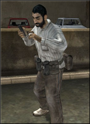

# ** _Zivilisten_ **{#zivilisten}

Wenn sie die irakische Aufständischen oder die Hamas-Fraktion spielen, können die Spieler wählen, ob sie als Zivilist spielen möchten. Die Hauptaufgabe dieser Rolle besteht darin, Informationen über die Streitkräfte der Koalition zu sammeln und die aufständischen Zellenführer zu intervenieren. Dieses Kit ist nicht mit Waffen ausgestattet, sondern verfügt über eine große Auswahl an Ausrüstung und Werkzeugen. Zivilisten können mit ihren Mobiltelefonen feindliche Truppen für ihr Team aufspüren, indem sie einen Marker auf die Karte setzen.

>
> Ein Zivilist

Zivilisten sind an bestimmte ** Regeln des Engagements gebunden ** \ (ROE \). Koalitionsstreitkräfte können nicht gegen Zivilisten feuern, die sich außerhalb der Regeln des Engagements befinden, und riskieren schwere Bestrafungen. Stattdessen müssen sie sie festnehmen oder warten, bis sie ein legitimes Ziel sind.

Damit ein Spieler einen Zivilisten festnehmen kann, muss er die Rückhalter oder die Schrotflinte mit einer Schrotschuss-Patrone benutzen.
> Zivilisten, die sich zum Selbstmord entscheiden, werden ebenfalls als festgenommen gezählt.

Wenn Sie einen Zivilisten außerhalb der ROE erschießen, werden Sie mit mehreren Strafen konfrontiert:
* Nach deinem nächsten Tod wirst du 120 Sekunden später pro Zivilschuss respawnen (bis zu 5 Minuten zusätzliche Verzögerung \)
* Sie können keine Kits für 10 Minuten anfordern
* Ihre Punktzahl wird auf 0 reduziert und der Kill wird nicht auf der Anzeigetafel angezeigt
* Dein Team verliert 10 Erkenntnispunkte

Auf der anderen Seite wird das Schießen eines Zivilisten innerhalb der ROE verursachen:
* Der Zivilist muss zusätzliche 120 Sekunden in der Respawn-Zeit haben
* Dein Team erhält 10 Erkenntnispunkte

Das Überfahren von Zivilisten in einem Fahrzeug oder das Töten derselben während des Aufstiegs von Leitern oder Seilen führt ebenfalls zu einer Strafe, wenn dies außerhalb der ROE geschieht.

### Regeln des Engagements (ROE)

Ein Zivilist wird innerhalb der ROE betrachtet und kann daher getötet werden, wenn eine dieser Bedingungen erfüllt ist:
* Erzeugt ...
* Habe ein Set mit einer Waffe aufgehoben ...
* Gebraucht ein Fahrzeug ...
* Benutzte eine Schaufel oder epi ...
* Jemanden wiederbeleben ...

... weniger als 2m vom Gefecht entfernt. Oder er muss einen bewaffneten Aufständischen neben sich haben, innerhalb von 5 m horizontal oder 1,5 m vertikal.

### Zivil werden

Damit du Zivilist wirst, musst du entweder einen nicht bewaffneten Soldaten spawnen lassen oder einfach [deine Ausrüstung ablegen]Halte T, rechtsklick und G. Denke daran nach dem spawnen zwei minuten zu warten befor Du das Kit ablegen kannst.

### Zivilfahrzeuge

Nicht bewaffnete Fahrzeuge, einschließlich Munitions-Techies und "Fake Garys", dürfen nicht von Koalitionstruppen zerstört werden.

Ein Fahrzeug gilt als zivil und kann daher nicht zerstört werden, wenn
* Ist leer
* Hat keine Waffe
* War letzte Verwendung vor mehr als 1 Minute
* Hat keine Feinde in der Nähe (3 Meter)

Die Nichteinhaltung dieser ROE führt zu:
* Verlust von 5 Intel-Punkten für das Team
* Verlust von 50 Punkten für den Spieler