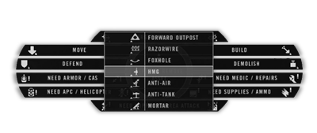
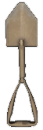
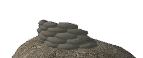

# The Squadleader

## _Guiding Squad_ {#guiding-squad}

As explained in the Battlefield Navigation section, the Squad Leader can place markers on the map for his squad members to follow. They will find a marker on their compass to follow as well as an icon on the map. The Squad Leader should use these as often as possible and can also use this to easily get the distance towards a target. He can do this from the mini-map by right clicking it and placing the marker or by pressing the **secondary radio key \(T\)** and point at the target and using one of the buttons to place the marker.

*  **Target** 
*  **Build** 
*  **Observe**
*  **Defend** 
*  **Demolish** 
*  **Move**

The commander can also order you. If you accept the order \(**PAGE UP**\) your marker will be replaced with the commander’s order.

## _Spotting Enemies_ {#spotting-enemies}

The **Squad Leader** in PR:BF2 has many functional abilities. He is able to mark enemy units on the map and forward contact reports to the team's commander with the ability to mark a target on the team's map. To perform these functions follow these steps:

1. Set a target position on the map to acquire an approximate position of to the contact.
2. Look towards the target position.
2. Select the radio from your inventory and use **the alternate fire key \(RMB\)** to activate it.
4. Select the type of target contact to mark on the map. Each player can place up to 3 markers which stay for 5 minutes.

> 

[Video Tutorial - Marking](https://www.youtube.com/watch?v=XNDb2yMuoho "Video Tutorial - Marking")

## _The GTL Designator \(GTLD\)_ {#gtld}

The Squad Leader kit and Spotter kit used by conventional forces are equipped with **GTLD \(Ground Target Laser Designator\).**. This piece of equipment has better zoom then the regular binoculars, includes a range-finder and allows you to paint enemy targets which can be targeted by friendly \(and enemy\) air unit's bombs or missiles.

With the GTLD equipped, you can right-click to increase the zoom level and left-click to toggle the on/off state. While on, the GTLD will emit a laze, that you must keep on your target until the bomb/missile hits it, unlike previous versions where the laze would "stick" to the target even without line of sight.

Additionally, while the lase is ON, you can access the main radio menu \(Q\) to request close air support \(CAS\) or call fire mortar missions. Doing so will automatically transmit a text message to your team detailing the request and add a target marker to the map.

## _Rally Points_ {#rally-points}

A Squad Leader has the ability to set **Rally Points \(RP\)**. This allows fallen squad members to regroup in a safe area with the rest of their squad. To place a RP you need to press **the secondary radio key \(T\)** and select **PLACE RALLY POINT**.

The following conditions must be met for the RP to be placed successfully:

* You are the leader of your squad and are equipped with the officer kit.
* You need to have 2 squad members close to you.
* Enemy is further than 50m away on 1x1km maps or 125m or 2x2km and 4x4km maps.

The rally point automatically disappears after 60 seconds unless:

* It is within 2x large map grid squares of a friendly FOB
* It is within 2x large map grid squares of a friendly APC or IFV. Only those of which you can request kits.

An enemy that comes within 50m on 1x1km maps or 125m or 2x2km and 4x4km maps from the rally point will disable it. On larger maps it is 600m.

A rally point rearms every 1 minute. Unless it has become overrun. In which case you need to wait 5 minutes.

## _Requesting Support_ {#requesting-support}

The squad leader can also use his radio to request support from other squads. To do so he must activate his radio and then press **the secondary radio key \(T\).** This will open up the menu for requesting support and deploying team assets. The lower five commands starting with **“NEED ...”** will place a map marker at your position. They also transmit a radio message to your team to alert them of your request. The **“NEED AREA ATTACK”** request behaves a bit different from the rest. On some maps conventional forces can use this command to request an **artillery barrage**. If your request is approved by the team's commander, the attack will strike after about one minute. After loading a new map or executing an area attack it takes 30 minutes until it is available again. Similarly unconventional factions have access to a mortar barrage every 20 minutes on most maps.

> 
>
> Requesting support through radio

## _Construction Work_ {#construction-work}

Constructing assets is an essential functionality of the Squad Leader which the team's Commander also possesses. When deploying and constructing a Forward Outpost \(FOB\) a Squad Leader needs to have an officer kit and a heavy supply crate within a 50m radius of his vicinity. 2 light supply crates offer the same capabilities as 1 heavy supply crate to achieve the same goal. Insurgents, Taliban and the Hamas can only deploy hideouts, mortars and anti-tank positions for their team which do not require supplies to build these structures. To perform this function either a cell leader or collaborator kit is necessary.

> 
>
> Building assets through radio

To deploy a structure follow these steps:

1. Select and activate the radio / cellphone.
2. Look in the direction where the structure should be positioned. It will be placed 10m in front of you.
3. Once you deploy it, press the **secondary radio menu key \(T\).**
4. Left click your mouse on **DEPLOY / REMOVE ASSET.**
5. Select the structure you want to build from the list.

> 
>
> Shovel needed to build up deployables.

Players currently standing where the deployable is being placed will die. So make sure your squad knows where you intend to build. Soldiers need to use **the entrenching tool** to build assets. Construction is complete once the digging stops.

Place the deployables on open terrain non obstructed area to avoid undesirable effects and unwanted placement locations. The deployable will only appear if its placement location isn't too far above or below your position.

To dismantle a built structure, squad members must use the entrenching tools right click to destroy an emplacement, then the Squad Leader is able to right-click **DEPLOY / REMOVE ASSET** menu whilst pointing towards the object no more than 5m away, to completely remove it.

Deployable Emplacements weapons can be rearmed by dropping ammunition bags next to them. Several bags are needed to completely rearm an emplacement.

> 
>
> Unbuild and build examples of a foxhole.

## _Deployable Structures_ {#deployable-structures}

Here is a list of the deployable structures and the requirements for building them. Deployable assets can be either dismantled with a shovel or alternatively destroyed with C4, IEDs, tank shells, APC shells, or any over forms of heavy ordnance. Deployables can also be completely destroyed by continuing to damage the base of the emplacement. Forward outposts and hideouts can be destroyed as well by ordnance or C4 plastic explosives and TNT. Squad leaders can remove unbuilt deployable emplacements with the radio in a similar way to how they were deployed, by alternatively using the right click to remove the deployable base. The alternate fire mode for the entrenchment tool also has the ability to dismantle unbuilt deployable emplacements. An important note on the requirements and limitations listed below is that all values about distance to an FOB and the maximum amount of assets per FOB are doubled on the CNC gamemode \(except for the amount of mortars\). Also remember that 2 large supply crates can also be replaced by 4 small supply crates or 1 large and 2 small crates. To learn more about logistics and crates see [the logistics chapter.](the_basics.md#logistics).

**Forward Operating Base \(FOB\):** The forward operating base, also known as a forward outpost serves as a defensive spawn position for the team. It comes online 90 seconds after being build. It becomes unspawnable for 30 seconds if 1 enemy is within 10m, 2 enemies within 50m, 4 enemies within 100m or 8 enemies within 150m. Requirements and limitations:

* Must be constructed within 50m of a friendly large supply crate.
* The team may have a total of 6 forward outposts at the same time.
* Must be constructed at least 200m from other forward outposts and the team's HQ.
* Must be constructed at least 10m away from the map border \(200m on CNC\).

**Hideout:** Insurgents use hideouts as a spawn location. If 2 or more enemies are close by \(within 50m\), spawning is disabled until 90 seconds after they leave or die. Requirements and limitations:

* Requested further than 200m from the closest hideout and the insurgent HQ.
* The team may have up to 6 hideouts at the same time.
* Must be constructed at least 10m away from the map border.

**Heavy MG:** A deployable heavy machine gun. Requirements and limitations:

* Must be placed within 200m of a FOB / hideout and at least 200m away from the team's CO-Post and 50m away from Vehicle Depot.
* 2 large supply crates must be within 200m.
* Only 2 MG’s per FOB and within 200m radius.
* The team can have up to 24 heavy MGs.

**Anti-Tank:** A deployable anti-tank missile launcher. This weapon features thermal imaging and 1 fixed level of magnification. Reloading takes 20s. Requirements and limitations:

* Must be placed within 200m of a FOB / hideout and at least 200m away from the team's CO-Post and 50m away from Vehicle Depot.
* 2 large supply crates must be within 200m.
* No other anti-tank emplacement may be within 200m distance and on that FOB.
* The team can have up to 3 anti-tank positions at the same time.

**Anti-Tank \(unconventional forces\):** The SPG9 AT-launcher only has a narrow range of traverse. It can shoot two types of ammunition and takes 15s to reload. Requirements and limitations:

* Must be placed within 200m of a FOB / hideout and at least 200m away from the team's CO-Post and 50m away from Vehicle Depot.
* 2 large supply crates must be within 200m \(only for the militia and Syrian Rebels\).
* No other anti-tank emplacement may be within 200m distance and on that FOB.
* The team can have up to 3 anti-tank positions at the same time.

**Anti-Air:** A deployable surface-to-air missile launcher. Requirements and limitations:

* Must be placed within 200m of a FOB / hideout and at least 200m away from the team's CO-Post and 50m away from Vehicle Depot.
* 2 large supply crates must be within 200m.
* No other anti-air emplacement may be within 200m distance and on that FOB.
* The team can have up to 6 anti-air emplacements.
* Unconventential forces get a DShK machine gun on a tripod as anti-air emplacement. 

**Foxhole:** A sandbag fortified foxhole provides cover against small arms and artillery strikes. Requirements and limitations:

* Must be placed within 200m of a FOB / hideout and at least 200m away from the team's CO-Post and 50m away from Vehicle Depot.
* 2 large supply crates must be within 200m.
* A maximum of 9 other foxholes, sandbags or segments of razor wire are within 200m and on that FOB.
* The team can have up to 60 foxholes, sandbag-walls, segments of razor wire in total.

**Sandbag-wall:** A sandbag wall is a small 5m long wall made of sandbags to hide behind and use as cover against small arms. Requirements and limitations:

* Must be placed within 200m of a FOB / hideout and at least 200m away from the team's CO-Post and 50m away from Vehicle Depot.
* 2 large supply crates must be within 200m.
* A maximum of 9 other foxholes, sandbags or segments of razor wire are within 200m and on that FOB.
* The team can have up to 60 foxholes, sandbag-walls, segments of razor wire in total.

**Razor wire:** A 10m wide road block of razor wire and tank traps. Requirements and limitations:

* Must be placed within 200m of a FOB / hideout and at least 200m away from the team's CO-Post and 50m away from Vehicle Depot.
* 2 large supply crates must be within 200m.
* A maximum of 9 other foxholes, sandbags or segments of razor wire are within 200m and on that FOB.
* The team can have up to 60 foxholes, sandbag-walls, segments of razor wire in total.

**Roadblock \(unconventional forces\):** A 5m or 10m \(right or left click\) wide road block of garbage. Requirements and limitations:

* Must be placed 200m away from the team's CO-Post and 50m away from Vehicle Depot.
* A maximum of 9 other roadblocks, razorwires, foxholes and sandbags can be within 200m.
* The team can have up to 100 roadblocks in total.

**Mortar:** A fixed mortar position that can provide indirect fire support over long distances. All factions can fire high-explosive rounds. Conventional forces and the militia can also use air-burst and smoke rounds. Mortars cannot be constructed on maps smaller than 2km. Requirements and limitations:

* Must be placed within 200m of a FOB / hideout and at least 200m away from the team's CO-Post and 50m away from Vehicle Depot.
* 2 large supply crates must be within 200m \(only needed for conventional forces, militia and Syrian Rebels\).
* The team can have up to 2 mortar positions at the same time.
* Both mortar positions must be placed within 50m of each other.

