# Weapons & equipment

## _General Weapons & Equipment_ {#general-weapons-equipment}

Weapons after prolonged movement sometimes take a moment to gain precision and accurately fire at long range targets. Engagements at short distances will be unaffected by movement based deviation. This allows players to make small positional corrections without suffering weapon inaccuracy. Going prone greatly reduces the player's accuracy for a few moments but provides the highest accuracy for engaging long distance targets once the player's aim has recovered.

Most weapons are set to semi-automatic operation by default.

Weapons need to be reloaded manually \(default: **R**\). Weapons deviation is not affected by having optics or iron sights equipped. Weapons are classified into categories in PR:BF2, often connected to the kits they are used by:

**Assault rifles** are usually available in several variants with different sights. Sighting in with magnified optics has an accuracy advantage but hindered by greatly reduced peripheral vision compared to reflex sights or iron sights.

> _Kits: All kits that do not use another primary weapon or are unarmed_

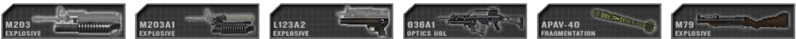**Underbarrel grenade launchers \(UGL\)** are attached to the underside of assault rifles and are used against groups of enemies or individuals that can't be hit by direct fire. They are also effective against unarmored vehicles and can be used effectively at ranges well beyond 200m. The grenades need to travel 28m before they arm or they will not detonate. UGLs can also fire smoke grenades that are used to obscure the enemy's view. The launcher range can be set by using a ladder sight attached to the weapon. While aiming down this sight, the main radio menu \(default: Q\) can be used to set the range to target distance [\(see Altering Sighting Range\)](weapons_and_equipment.md#altering-sighting-range). When engaging targets higher or lower than the predefined distances, it is important to compensate for this. On night maps the grenadier will also have access to flare rounds.

> _Kits: Grenadier_

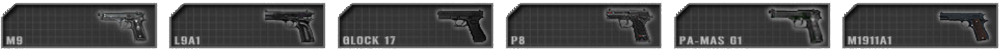**Side arms** are traditionally used by squad leaders of conventional forces as a backup and a sign of authority. Snipers are also equipped with a side arm for self-defense while relocating. Some insurgents that don't have a primary weapon use a side arm instead.

> _Kits: Officer, Sniper, Pilot, Cell Leader, Vietnam Grenadier, various Insurgent kits_

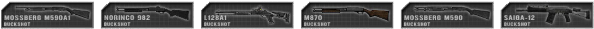**Shotguns** are deadly when used in close quarters. They can also be used to breach locked doors and gates. Insurgent Civilians can be arrested with buckshot rounds which simulates incapacitating an informant with rubber buckshots. The British semi-automatic shotgun, the L128A1 can also fire sabot solid slugs which are effective at long ranges. Some shotguns use breaching slugs which can only be used to breach locked doors.

> _Kits: Rifleman Breacher on conventional forces. Various Insurgent / Hamas / Taliban / Militia kits_

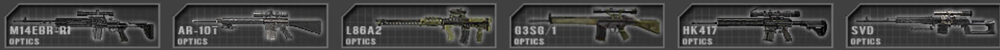**Designated marksman rifles \(DMR\)** are used to engage distant priority targets with paced accurate fire. They can be deployed to greatly increase their accuracy at the cost of mobility. A player's stance does affect the long range accuracy while the DMR is deployed, and its optimal firing position is in prone. When firing at targets up to 600m away you are required to compensate for the bullet drop. It is still vital to compensate for moving targets at range. To maximize accuracy the marksman should wait about one second per round fired.

> _Kits: Marksman_

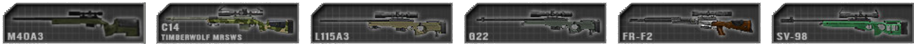**Sniper rifles** are used to engage high-priority targets at long ranges. Their rate of fire is slow since they operate using bolt action. The player's stance does influence the sniper rifle's long range accuracy. Bullet drop compensation is only needed at ranges exceeding 600m. Maximum accuracy is obtained by waiting for about 8 seconds after movement and 4s after shooting. The "switch fire mode" key \(default 3\) can be used to steady your breathing which lasts for about 8 seconds. This sound can help you estimating the time needed to regain accuracy. Keeping the fire button pressed after shooting will allow you to track your shot before rebolting the rifle.

> _Kits: Sniper_

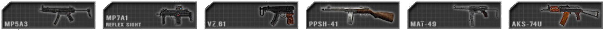**Sub machine guns \(SMG\)** are used in close quarter situations at short range. Their rate of fire is rapid and they primarily fire pistol ammunition such as 9mm rounds, although there are exceptions to the fact. Some submachine guns fall under the classification of personal defense weapon \(PDW\) which usually have a shorter barrel length giving them increased maneuverability and portability. These weapons can be used on the move with little to no movement deviation but are restricted by their effective range.

> _Kits: Crewman, Rifleman AT, Heavy Antitank, Squad leader, Rifleman Breacher on unconventional forces_

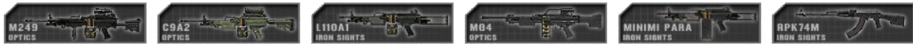**Light machine guns \(LMG\)** are used to suppress the enemy and can devastate an enemy squad when used at medium range or in ambush situations. They can be deployed to greatly increase their accuracy, stability and range. When using the deployed LMG, accuracy is increased but only when mobility is minimal and is not suitable for use when mobile. The player's stance does affect its long range accuracy, and its optimal firing position is in prone. In this position you will yield the highest accuracy at long ranges. The undeployed mode is used for when a player is mobile and needs to return fire without delay at shorter ranges.

> _Kits: Automatic Rifleman_

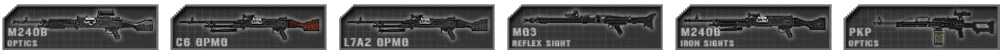**Medium machine guns \(MMG\)** are a medium class version of the machine gun. They use a larger 7.62mm caliber round which can have devastating effects in certain situations and are excellent for suppressing enemy at long range, subsequently they are limited to only having a deployed mode and require a 10 seconds to setup and settle before they reach optimal firing accuracy.

> _Kits: Machine Gunner_

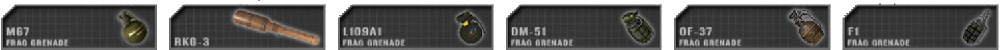**Fragmentation grenades** have a large blast radius but they are not accurate when thrown whilst moving or jumping and their range is relatively short. It takes about 5 seconds until they detonate. Some grenades like the RGO and RKG grenades explode on impact. The RKG is also an example of a grenade meant for usage against vehicles. The stone only causes minor injuries when striking a player but several hits can still be lethal. To warn your allies before throwing a grenade you can use the main radio key \(default: Q\) while holding the grenade to shout out a warning, or alternatively use mumble.

> _Kits: Grenades: most Infantry kits, especially Officers and Riflemen_ \| _stone: civilian and several insurgents_

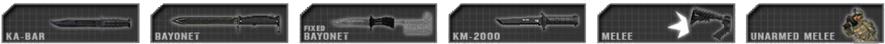**Knifes & Bayonets** are instantly lethal if they strike the enemy. Enemy insurgent combatants killed by knife counts as an arrest. Unarmed melee attacks take about 5 hits to kill an enemy.

> _Kits: Armed Melee: all except for Pilot, Civilian and Unarmed \| Unarmed Melee: Pilot and Unarmed_

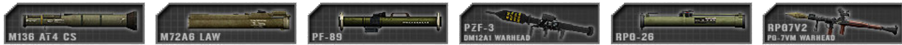**Light anti-tank launchers \(LAT\)** are used against unarmored and lightly armored targets. They are not effective against medium or heavy armor. The operator needs to prepare the launcher by standing still to settle the aim which takes about 4 seconds before you reach optimal firing accuracy. Depending on which particular launcher you are using, is dependent on how they operate. Some launchers are ranged to the reticule, others are adjustable, but generally they are accurate to about 500m. Effectively hitting a target at range requires skill and timing to be successful. A launcher’s range can be set by using an adjustable range sight mounted on the weapon, while aiming down this sight. To perform this operation, hold down the main radio commo-rose \(default: Q\) and select the range to your target. [\(see Altering Sighting Range\)](weapons_and_equipment.md#altering-sighting-range) When engaging targets between the set ranges, you can manually compensate the angle of attack by either elevating your aim or de-elevating to maintain an effective hit on target.

> _Kits: Rifleman AT, Militia / Taliban / Hamas Anti Tank_

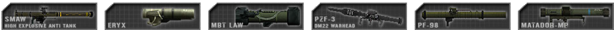**Heavy anti-tank launchers \(HAT\)** are used to engage armored vehicles. They can destroy light and medium armor with a single hit, while main battle tanks \(MBT\) take multiple hits to destroy. The effectiveness of the heavy AT is dependent on where you hit the MBT. The armor of a tank is at its weakest at the rear of the vehicle and on the top of the turret. Conversely the strongest side of the tank is the front. To prepare the weapon for firing you first have to settle the weapon for a substantial amount of time, around 10 seconds. To effectively track the target you have to be at a long range, otherwise the weapon becomes inaccurate whilst tracking. Once the reticule markers settle in the centered position you are ready to fire. Particular launchers are equipped with guide by wire which allows you to guide the warhead directly to the target. To track a moving target, hold down the primary fire button until the missile fires and continue to track the target until impact. Some HATs are unguided and fire straight and a few display no reticule markers. Prior to firing make sure the target is more than 30m away from you, otherwise the warhead will not arm, and will not detonate.

> _Kits: Conventional forces Anti Tank_

**Surface-to-air missiles \(SAM\)** are used to take down enemy aircraft. To achieve this you need to visually acquire the target by tracking it through the air. Once tracking is established you will hear a low tone, after a few seconds when lock is achieved you will hear a secondary high tone, at this point you can fire. Countermeasures such as flares will prevent you from effectively destroying your target, so your angle of attack in relation to the vehicle’s travelling direction is paramount to achieve a hit. Enemy pilots will receive a warning sound a few seconds after they have been locked-on by a SAM giving them time to maneuver away from the threat. Some older factions like the Falklands factions with the Blowpipe will not have locking AA weapons and will need to be manually guided.

> _Kits: Anti Aircraft_

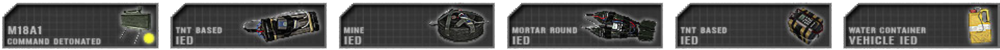**Remote detonated explosives** are explosives that are detonated by a remote device trigger by the individual who placed the explosives and are generally used for ambushes and defence. **Anti-Personnel Mines** \(Claymores\) take 5 seconds to arm after placing. When arming the detonator a sound will indicate when this time has elapsed. If explosives are triggered prematurely, they won't explode at all. IEDs don't have this safeguard. Most explosives have to be setup whilst in the prone position. A player can place up to 4 AP mines and 5 C4 packs or IEDs simultaneously. Some soldiers can place two independent groups of explosives which can be triggered individually. These explosives can all be diffused by the Combat Engineer’s wrench. During placement you can place a marker on the map for friendly forces by pressing **Q**. You can place up to 3 markers in total.

> _Kits: AP Mines: Rifleman AP \| Mine, Mortar, TNT IEDs: Sapper \| Water Container IED: Sapper and unconventional Engineer_

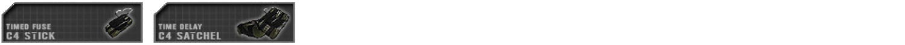**Time detonated explosives** are explosives on a timer that detonate shortly after they have been placed and are mainly used for taking out stationary assets such as enemy firebases, ammo caches and abandoned enemy vehicles. The two main types of Timed Explosives are **the Large and Small C4 charges**. The Large C4 is just a bit over twice as powerful as the Small C4 and only available to the Conventional Forces Combat Engineer Kit while the Small C4 is carried by both the Conventional Forces Combat Engineer and Breacher kits. You only need to place one charge of either the Large or Small C4s in order to destroy a firebase, but a single Small C4 charge will not destroy a firebase right away, instead the firebase will collapse a few seconds after the charge has detonated, giving the opposing team time to repair the firebase. To destroy the foundation of a firebase or other deployable asset, simply place another Small C4 charge on the foundation and it will destroy it shortly after detonating. The Small C4 can also be used to take out stationary vehicles, with 1x Small C4 to take out light armored vehicles \(Land Rovers, Civilian Cars, Technicals, lightly armoured HMMWVs, etc.\), 2x Small C4s to take out Armoured Jeeps and Trucks \(Up-Armoured HMMWV, Panther CLV and Support & Logistics Trucks such as the M-35, etc.\), 3x Small C4s to take out APCs. These charges can be diffused by the Combat Engineer’s Spanner/Wrench.

> _Kits: Small C4: Conventional Forces Combat Engineer & Breacher \| Large C4: Conventional Forces Combat Engineer_

**Mines** are contact explosivesthat Combat Engineer classes have access to. These can be played anywhere on the terrain and will visibly stick out. During placement you can place a marker on the map for friendly forces by pressing **Q**. You can place up to 3 markers in total. Mines can be removed with the wrench of a combat engineer.

> _Kits: Combat engineer_

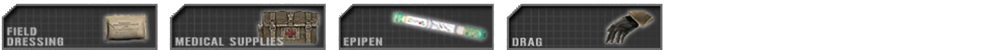**Field dressings** restore 25% health. They are thrown onto the ground to heal the player standing closest to the dressing. Field dressings are selected by pressing the 8 or 9 key. **The first aid kit** can fully heal a player and is used by keeping the fire button pressed while aiming at the person to be healed. First aid kits are no longer dropped and take some time to fully heal a heavily injured player. A medic can heal himself by using the patches provided. Players inside a vehicle with a medic will heal automatically over time. **Resuscitate** is used to prepare a wounded player prior to administering an epinephrine shot. **The epipen** is then used to revive them. Freshly revived soldiers need immediate medical treatment to prevent them from bleeding out.

> _Kits: Field Dressing: all soldiers \| First Aid kit,Resuscitate, Epipen: Combat Medic / Corpsman / Insurgent Medic_

**Extra Ammunition** can be used when a player is running out of rounds. A single ammo bag will usually provide a few magazines and a grenade or two. The ammo bag can also be used to rearm deployable weapons like MGs, antitank launchers and mortar emplacements.

> _Kits: Rifleman and various Insurgent rifleman kits_

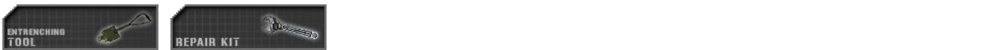**Entrenchment tool** is used to construct deployable structures for the team. It can't be used offensively. To construct a structure you need to point towards it and hold the fire button until the digging animation stops. The alternate commo-rose option allows squad leaders to demolish friendly foxholes and razor wire road blocks.

**The Wrench/Repair Kit** is used to disarm and remove explosives such as land mines, IEDs, trip flares and grenade traps. It can also provide repairs to particular light vehicles when they have sustained damage. It can also be used to build razor wire. Both the shovel and the wrench are capable of repairing a cache.

> _Kits: Entrenching Tool: all except for Officer, Combat Medic / Corpsman, Sniper, Pilot, Cell leader and Hamas Civilian_
>
> _Wrench: Conventional forces Combat Engineer_
>
> 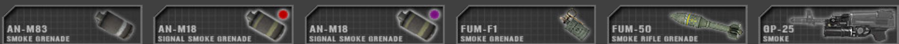**Smoke Grenades** are used to conceal troop movement or to signal friendly aircraft. Smoke screen generally take about 30 seconds to augment and fill out. The cover lasts for more than one minute before dissipating. _Kits: Smoke Grenade: most kits \| Signal Smoke: Officer, conventional forces Sniper, Pilot_

**Binoculars** allow soldiers to spot distant enemies and identify unknown contacts. Officers and cell leaders can also use their binoculars to request mortar strikes. **The ground laser target designator** \(GTLD\) is used to mark targets for engagement by friendly aircraft and mortar sites.

> _Kits: Binoculars: Crewman, Sniper and most kits on unconventional factions \| GTLD: Officer and Spotter for conventional forces_

**Radios and Cellphones** are used to report hostile contacts to the rest of the team. They can also be used by squad leaders to request support from other units and to place deployable structures.

> _Kits: Officer, Cell Leader, Spotter, Civilian_

**The Grappling Hook** is used to traverse over walls, buildings or to gain access to the top of structures to allow key squad member to have the advantage of high. After the hook has successfully attached itself to a surface, any player can accend up the rope by pressing the “enter/exit” key \(default: E\) and moving forward to climb and backwards to slide down the rope. They remain in position for 3 minutes and can be retrieved by the player using the pickup kit key \(default: G\).

> _Kits: Rifleman Breacher, Scout, Civilian_

**Parachutes** are used by pilots and paratroopers. They are deployed by hammering the 9-key frantically. Parachutes need to be opened an ample time before reaching the ground to avoid injury or a mild case of death. After your Squad Leader has reached the ground on a map supporting paradrops, a special supply crate appears next to him. This crate can only be used to request kits.

> _Kits: Pilot, any spawnable kit used by a team with a paradrop spawn point_

## _Back Up Iron Sights \(BUIS\)_ {#buis}

**Back up iron sights \(BUIS\)** are designed to provide the operator with an alternative method to acquisition a target depending on situation. Provided the weapon has BUIS equipped, a player will able to switch between backup sights and optics using **the pre-existing Cycle Camera key \(C**\). The player can toggle between the sight modes which is indicated by the BUIS letter in the lower right hand corner. S for scope, B for BUIS. The BUIS mode can be toggled at any time whether you are aiming down the sight or not, but you must re-aim to change between the modes.

## _Altering Sighting Range_ {#altering-sighting-range}

