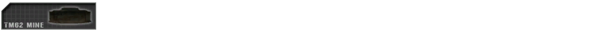

# Weapons & equipment

## _General Weapons & Equipment_ {#general-weapons-equipment}

Weapons after prolonged movement sometimes take a moment to gain precision and accurately fire at long range targets. Engagements at short distances will be unaffected by movement based deviation. This allows players to make small positional corrections without suffering weapon inaccuracy. Going prone greatly reduces the player's accuracy for a few moments but provides the highest accuracy for engaging long distance targets once the player's aim has recovered.

Most weapons are set to semi-automatic operation by default.

When aiming with non-scoped weapons, you can hold **Shift** to focus your aim, providing you with small magnification at the cost of peripheral vision.

Weapons need to be reloaded manually \(default: **R**\). Weapons deviation is not affected by having optics or iron sights equipped. Take note that the bullet drop indicators found in a number scoped rifles are just for show and do not work; bullet drop to the extend that it is visible from the center of the reticle starts to take effect only at moderately high distances\(500m and above\) and is much more mild than indicated by the range marks. The point of aim is located in the center of the reticle, regardless of any and all range indicators the actual scope would indicate for military personnel. Weapons are classified into categories in PR:BF2, often connected to the kits they are used by:

**Assault rifles** are usually available in several variants with different sights. Sighting in with magnified optics has an accuracy advantage but hindered by greatly reduced peripheral vision compared to reflex sights or iron sights.

> _Kits: All kits that do not use another primary weapon or are unarmed_

**Underbarrel grenade launchers \(UGL\)** are attached to the underside of assault rifles and are used against groups of enemies or individuals that can't be hit by direct fire. They are also effective against unarmored vehicles and can be used effectively at ranges well beyond 200m. The grenades need to travel 28m before they arm or they will not detonate. UGLs can also fire smoke grenades that are used to obscure the enemy's view. The launcher range can be set by using a ladder sight attached to the weapon. While aiming down this sight, the main radio menu \(default: **Q**\) can be used to set the range to target distance [\(see Altering Sighting Range\)](weapons_and_equipment.md#altering-sighting-range). When engaging targets higher or lower than the predefined distances, it is important to compensate for this. On night maps the grenadier will also have access to flare rounds.

> _Kits: Grenadier_

**Side arms** are traditionally used by squad leaders of conventional forces as a backup and a sign of authority. Snipers are also equipped with a side arm for self-defense while relocating. Some insurgents that don't have a primary weapon use a side arm instead.

> _Kits: Officer, Sniper, Pilot, Cell Leader, Vietnam Grenadier, various Insurgent kits_

**Shotguns** are deadly when used in close quarters. They can also be used to breach locked doors and gates. Insurgent Civilians can be arrested with buckshot rounds which simulates incapacitating an informant with rubber buckshots. Some shotguns use breaching slugs which can only be used to breach locked doors. Shotguns are also used for destroying enemy crates \(for large crates shoot the wooden panel for maximum effect\).

> _Kits: Rifleman Breacher on conventional forces. Various Insurgent / Hamas / Taliban / Militia kits_

**Designated marksman rifles \(DMR\)** are used to engage distant priority targets with paced accurate fire. They can be deployed to greatly increase their accuracy at the cost of mobility. A player's stance does affect the long range accuracy while the DMR is deployed, and its optimal firing position is in prone. When firing at targets more than 500m away, bullet drop starts to be a factor. Elevate the gun slightly above the intended point of impact. Should the bullet still impact low, adjust as needed and try again. It is still vital to compensate for moving targets at range. To maximize accuracy the marksman should wait about one second per round fired.

> _Kits: Marksman_

**Sniper rifles** are used to engage high-priority targets at long ranges. Their rate of fire is slow since they operate using bolt action. The player's stance does influence the sniper rifle's long range accuracy. They are the most accurate type of infantry-held firarm and hit in a very small cone once deviation has settled. Much like DMRs bullet drop compensation is not necessary unless the target distance exceeds around 500m, but aiming for the chest of an enemy standing upright at higher distance is very likely to still land in the stomach area, which will incapacitate. Only targets far away, who’re mostly behind cover or in prone position will require you to aim above the chest or head to score a hit. Maximum accuracy is obtained by waiting for about 8 seconds after movement and 4s after shooting. If at long range you can't see the bullet impact because of manually chambering with the bolt, instead of letting go off the left click button when shooting, hold it to pause the chambering.

> _Kits: Sniper_

**Sub machine guns \(SMG\)** are used in close quarter situations at short range. Their rate of fire is rapid and they primarily fire pistol ammunition such as 9mm rounds, though some use a shortened type of rifle cartridge instead. These are commonly referred to as Personal Defense Weapon\(PDW\) and sit somewhere between the SMG and Assault Rifles in terms of handling, recoil, damage and accuracy but function closer to SMGs due to a lack of magnified optical attachments.

> _Kits: Crewman, Rifleman AT, Heavy Antitank, Squad leader, Rifleman Breacher on unconventional forces_

**Light machine guns \(LMG\)** are used to suppress the enemy and can devastate an enemy squad when used at medium range or in ambush situations. They can be deployed to greatly increase their accuracy, stability and range. When using the deployed LMG, accuracy is increased but only when mobility is minimal and is not suitable for use when mobile. The deployed mode also decreases firing induced inaccuracies and allow the user to fire longer bursts more accurately than all other handheld automatic weapons. Depending on distance to the enemy, bursts of 3 to 7 rounds with short breaks are the ideal way of using these weapons to their maximum effectiveness. Belt-fed LMGs usually have 100 rounds of ammunition, some even more, but take quite long to reload, meaning magazine-fed ones are quicker in this regard but have to be much more aware of how many rounds they’ve fired out of their current magazine. The player's stance does affect its long range accuracy, and its optimal firing position is in prone. In this position you will yield the highest accuracy at long ranges. The undeployed mode is used for when a player is mobile and needs to return fire without delay at shorter ranges.

> _Kits: Automatic Rifleman_

**Medium machine guns \(MMG\)** are a medium class version of the machine gun. They use a larger 7.62mm caliber round which can have devastating effects in certain situations and are excellent for suppressing enemy at long range, but are limited to only having the deployed mode of operation due to weight.  After longer stretches of movement, they take about 7 seconds to reach maximum firing accuracy. Though not quite as much, MMGs can, much like their little counterparts, fire long bursts of automatic or rapid fire with less accuracy penalty and recoil than other automatic firearms. Due to their increased damage and high capacity they also tend to be used to damage enemy unarmoured vehicles and its passengers. Unlike the LMGs, MMGs are all belt-fed and thus require some time to reload.

> _Kits: Machine Gunner_

**Fragmentation grenades** have a large blast radius but they are not accurate when thrown whilst moving or jumping and their range is relatively short. It takes about 5 seconds until they detonate. Some grenades like the RGO and RKG grenades explode on impact. The RKG is also an example of a grenade meant for usage against vehicles. To warn your allies before throwing a grenade you can use the main radio key \(default: Q\) while holding the grenade to shout out a warning, or alternatively use mumble. Pressing Right Mouse Button with a grenade in your hand will drop it at your feet \(use with care\), while holding down the button will let you aim it \(use above your thumb as a reference\) and letting go of RMB will throw the grenade as usual.

Unconventional forces can use stones, which only cause minor injuries when striking a player but several hits can still be lethal. 

> _Kits: Grenades: most Infantry kits, especially Officers and Riflemen_ \| _stone: civilian and several insurgents_

**Knifes & Bayonets** are instantly lethal if they strike the enemy. Enemy insurgent combatants killed by knife counts as an arrest. Unarmed melee attacks take about 5 hits to kill an enemy.

> _Kits: Armed Melee: all except for Pilot, Civilian and Unarmed \| Unarmed Melee: Pilot and Unarmed_

**Light anti-tank launchers \(LAT\)** are used against unarmored and lightly armored targets. They are not effective against medium or heavy armor. It takes some time for the launcher to be set up for firing when switching to it, and they take time to settle after movement as well. Many launchers are using iron sights with the option to be adjustable. To adjust, press and hold the main commo-rose key\(default: Q\), then select the range via left-click [\(see Altering Sighting Range\)](weapons_and_equipment.md#altering-sighting-range). Other launchers are provided with an optic sight with working range marks instead and thus do not require being sighted in. Finally, a small group of systems use a scope but have to be sighted prior to launch. When engaging targets between the set ranges, you can manually compensate the angle of attack by either elevating your aim or de-elevating to maintain an effective hit on target.

> _Kits: Rifleman AT, Militia / Taliban / Hamas Anti Tank_

**Heavy anti-tank launchers \(HAT\)** are used to engage armored vehicles. They can destroy light and medium armor with a single hit. However, main battle tanks\(MBTs\) can take multiple frontal hits and it’s recommended to launch only when being able to hit the sides, rear or top of the tank, with the latter two being guaranteed one-shot kills outside of a few specific warheads. To prepare the weapon for firing you first have to settle the weapon for a substantial amount of time, around 10 seconds. Unlike LATs, most HATs outside of the ones used by unconventional forces come equipped with a scope with range marks at the very least. Some might not have range markers and instead have the ability to be guided by the operator after launch, effectively being an Anti Tank Guided Missile system \(ATGM\) instead of a mere rocket launcher.

When using an ATGM, the operator has to hold down the fire key until the missile is launched \(time varies depending on missile system\), which is indicated by a green SEEK displayed above the compass. After launch, the missiles have around 600m of guiding range before the wire used to signal control commands to the missile snaps, at which point the missile spins out of control and is highly unlikely to hit. The reliance on wire to control the missile also makes it impossible to bend the missile around building corners and solid objects of any kind. The missiles also often travel in a slight spiraling motion around the point of aim, requiring the operator to give the missile some room to manoeuvre. Some of these weapon systems cannot be launched from the prone position, attempting to launch will cause the weapon system to become entirely inoperable. If that happens, the Kit needs to be dropped, causing it to despawn after some minutes. [\(See Kit Drop Procedure section\)](kits.md#drop-kit)

Very few ATGM systems have a built-in automatically-executed top-attack mode which can be selected prior to launch via the main commo rose key\(default: Q\) when aiming with the weapon system. The top attack mode increases the chances of a successful strike on a target’s weaker top side armour, but it takes additional time for the missile to climb to altitude and dive down on target, it furthermore increases the minimum distance at which the weapon can be used to around 150m, so the operator might want to select the direct operation mode instead to decrease the missile’s flight time and minimum distance. Do note that these missiles are „smart“ and do not rely on wire controls to be guided, they are guided by the chosen point of impact.

Because of gameplay reasons they are NOT Fire-and-Forget with homing ability like their IRL counterparts though.

> _Kits: Conventional forces Anti Tank_

**Surface-to-air missiles \(SAM\)** are used to take down enemy aircraft. To achieve this you need to visually acquire the target by tracking it through the air. Once tracking is established you will hear a low tone, after a few seconds when lock is achieved you will hear a secondary high tone, at this point you can fire. Countermeasures such as flares will prevent you from effectively destroying your target, so your angle of attack in relation to the vehicle’s travelling direction is paramount to achieve a hit. Enemy pilots will receive a warning sound a few seconds after they have been locked-on by a SAM giving them time to maneuver away from the threat. Some older factions like the Falklands factions with the Blowpipe will not have AA weapons with target locking and will need to be manually guided.

> _Kits: Anti Aircraft_

**Remote detonated explosives** are explosives that are detonated by a remote device trigger by the individual who placed the explosives and are generally used for ambushes and defence. **Anti-Personnel Mines** \(Claymores\) take 5 seconds to arm after placing. When arming the detonator a sound will indicate when this time has elapsed. If explosives are triggered prematurely, they won't explode at all. IEDs don't have this safeguard. Most explosives have to be setup whilst in the prone position. A player can place up to 4 AP mines and 5 C4 packs or IEDs simultaneously. Some soldiers can place two independent groups of explosives which can be triggered individually. These explosives can all be diffused by the Combat Engineer’s wrench. After placing the explosive, the game will put an icon on the map for friendlies to see. They will however not receive a visual indicator of these in their HUD unlike BF2 when in close proximity of them. Insurgent sappers can put up stone markers to warn friendlies of buried IEDs but it might also inform the coalition forces to be wary of them. Should the automatic map marker placement not have worked, you can press and hold **Q**, then left click when having an IED-type weapon selected to place up to 3 mine markers manually.

> _Kits: AP Mines: Rifleman AP \| Mine, Mortar, TNT IEDs: Sapper \| Water Container IED: Sapper and unconventional Engineer_

**Time detonated explosives** are explosives on a timer that detonate shortly after they have been placed and are mainly used for taking out stationary assets such as enemy firebases, ammo caches and abandoned enemy vehicles. The two main types of Timed Explosives are **the Large and Small C4 charges**. The Large C4 is just a bit over twice as powerful as the Small C4 and only available to the Conventional Forces Combat Engineer Kit while the Small C4 is carried by both the Conventional Forces Combat Engineer and Breacher kits. You only need to place one charge of either the Large or Small C4s in order to destroy a firebase, but a single Small C4 charge will not destroy a firebase right away, instead the firebase will collapse a few seconds after the charge has detonated, giving the opposing team time to repair the firebase. To destroy the foundation of a firebase or other deployable asset, simply place another Small C4 charge on the foundation and it will destroy it shortly after detonating. The Small C4 can also be used to take out stationary vehicles, with 1x Small C4 to take out light armored vehicles \(Land Rovers, Civilian Cars, Technicals, lightly armoured HMMWVs, etc.\), 2x Small C4s to take out Armoured Jeeps and Trucks \(Up-Armoured HMMWV, Panther CLV and Support & Logistics Trucks such as the M-35, etc.\), 3x Small C4s to take out APCs. The large C4 can be diffused by the Combat Engineer’s Spanner/Wrench.

> _Kits: Small C4: Conventional Forces Combat Engineer & Breacher \| Large C4: Conventional Forces Combat Engineer_

**Mines** are contact explosives which the Combat Engineer classes have access to. They will be exposed above the ground but fast moving vehicles still might drive over them. Upon placing a Mine \(Press and hold **Q**\), similar to IEDs, a marker will be put up on your team’s map, but you can also place up to 3 mine markers manually. Mines can be removed with the wrench of a combat engineer or detonated with C4.

> _Kits: Combat engineer_

**Field dressings** restore 25% health. They are thrown onto the ground to heal the player standing closest to the dressing. Field dressings are selected by pressing the 8 or 9 key. **The first aid kit** can fully heal a player and is used by keeping the fire button pressed while aiming at the person to be healed. First aid kits are no longer dropped and take some time to fully heal a heavily injured player. A medic can heal himself by using the patches provided. Players inside a vehicle with a medic will heal automatically over time. **The epipen** is then used to revive them. Freshly revived soldiers need immediate medical treatment to prevent them from bleeding out. **Drag** is used to move a wounded player prior to administering an epinephrine shot. You need to be crouched before being able to use this. 

> _Kits: Field Dressing: all soldiers \| First Aid kit, Drag, Epipen: Combat Medic / Corpsman / Insurgent Medic_

**Extra Ammunition** can be used when a player is running out of rounds. A single ammo bag will usually provide a few magazines and a grenade or two. The ammo bag can also be used to rearm deployable weapons like MGs, anti-tank launchers and mortar emplacements.

> _Kits: Rifleman and various Insurgent rifleman kits_

**Entrenchment tool** is used to construct deployable structures for the team. It can't be used offensively. To construct a structure you need to point towards it and hold the fire button until the digging animation stops. The alternate commo-rose option allows squad leaders to demolish friendly foxholes and razor wire road blocks.

**The Wrench/Repair Kit** is used to disarm and remove explosives such as land mines, IEDs, trip flares and grenade traps. It can also provide repairs to particular light vehicles when they have sustained damage. It can also be used to build structures. Both the shovel and the wrench are capable of repairing a cache.

> _Kits: Entrenching Tool: all except for Officer, Combat Medic / Corpsman, Sniper, Pilot, Cell leader and Hamas Civilian_

> _Wrench: Conventional forces Combat Engineer_

**Smoke Grenades** are used to conceal troop movement or to signal friendly aircraft. Smoke screen generally take about 30 seconds to augment and fill out. The cover lasts for more than one minute before dissipating. 

> _Kits: Smoke Grenade: most kits \| Signal Smoke: Officer, conventional forces Sniper, Pilot_

**Binoculars** allow soldiers to spot distant enemies and identify unknown contacts. Officers and cell leaders can also use their binoculars to request mortar strikes. **The ground laser target designator** \(GLTD\) is used to mark targets for engagement by friendly aircraft and mortar sites.

> _Kits: Binoculars: Crewman, Sniper and most kits on unconventional factions \| GLTD: Officer and Spotter for conventional forces_

**Radios and Cellphones** are used to report hostile contacts to the rest of the team. They can also be used by squad leaders to request support from other units and to place deployable structures.

> _Kits: Officer, Cell Leader, Spotter, Civilian_

**The Grappling Hook** is used to traverse over walls, buildings or to gain access to the top of structures to allow key squad member to have height advantage. After the hook has successfully attached itself to a surface, any player can accend up the rope by pressing the “enter/exit” key \(default: E\) and moving forward to climb and backwards to slide down the rope. They remain in position for 3 minutes and can be retrieved by the player using the pickup kit key \(default: G\). If you get incapaciated while climbing a rope - you will die, and not be reviveable \(much like climbing a ladder\).

> _Kits: Rifleman Breacher, Scout, Civilian_

**Parachutes** are used by pilots and paratroopers. They are deployed automatically when spawning in a paratrooper deployed faction. When ejecting from a fixed-wing aircraft the ejection seat will also automatically deploy the parachute. It can also be deployed manually in other cases \(default: **9**\). Parachutes need to be opened an ample time before reaching the ground to avoid injury or a mild case of death. After your Squad Leader has reached the ground on a map supporting paradrops, a special supply crate appears next to him. This crate can only be used to request kits.

> _Kits: Pilot, any spawnable kit used by a team with a paradrop spawn point_

## _Back Up Iron Sights \(BUIS\)_ {#buis}

**Back up iron sights \(BUIS\)** are designed to provide the operator with an alternative method to acquisition a target depending on situation. Provided the weapon has BUIS equipped, a player will able to switch between backup sights and optics using **the pre-existing Cycle Camera key \(C\)**. On the lower right hand corner is a small icon \(S for scope, B for BUIS\) displaying the currently selected view method. It is possible to change which method you’re using when aiming down sights, increasing your ability to either locate hostiles or precisely aim quickly. 




## _Altering Sighting Range_ {#altering-sighting-range}

{{ "Video Tutorial - Sighting Range" | youtube("cLfdH1EHWPA") }}
