# Conseptos Basicos

Primeramente deberás  **nirte a un escuadron.**. Algunos servers te pueden forzar a hacerlo al expulsarte después de un periodo de advertencia. El juego es de lejos mucho más jugándolo con una patrulla funcional. Si necesitas ayuda, **solo pregunta a los jugadores de tu escuadron** que hacer. En la medida de lo posible, usa Mumble. Es comúnmente usado en PR. Al jugar PR: BF2 sin un micrófono no vivirás la máxima experiencia, así que es una inversión sabia. Si nadie responde, trata de unirte a otra patrulla o usar el chat general. Hay muchos miembros de la comunidad que están dispuestos a echarles una mano a los nuevos jugadores. Puedes jugar primero BF2 a modo de tutorial para familiarizarte con la interfaz. Este manual se centrará en las diferencias con BF2.

## _Selección de Kits y Spawn_ {#kit-selection-and-spawning}

*	Cuando empieces a jugar, se recomienda que solo aparezcas como fusilero con la mira de tu elección. De esta manera podrás aprender mejor los fundamentos básicos del juego.
*	Después de aprender las bases de la infantería, podrás pedirle a tu SL que te asigne un kit especializado cuando te sientas preparado para la tarea. Si quieres probar nuevo equipamiento o vehículos, podrás hacerlo en el modo coop sin causarle percances a tu patrulla arriesgando los assets del equipo..
* Los kits especializados y más difíciles de operar son generalmente limitados y solo pueden ser obtenidos si la patrulla cumple con ciertas condiciones. Estos kits reservados son de provisión limitada y siempre deberías preguntar antes de solicitar uno.
* os kits pueden ser solicitados desde el menú de spawn principal  \(Como en BF2\),na caja de suministros  [\(Ver Logistica\)](the_basics.md#logistics) o junto a un APC / IFV. Para poder solicitar un kit de una caja de suministros o vehículo, debes ser parte de una patrulla.

En PR: BF2 no puedes reaparecer en cada punto de control de tu equipo. Los puntos de respawn disponibles son:

* **El Rally Point de tu escuadrón \(RP\)** es un círculo verde que rodea un punto de generación con el número de tu escuadrón junto a él. Dependiendo de la ubicación del RP de tu escuadrón en relación con el FOB de un equipo, se determinará su longevidad. Nota: si apareces en el punto de reunión de otro escuadrón, aparecerás automáticamente en tu propio punto de reunión o en cualquier FOB cercano. Si no hay ninguno disponible, será trasladado a la base principal de su equipo. Si es invadido por el enemigo, el RP de tu escuadrón desaparecerá. Los RP solo están disponibles para las fuerzas convencionales. [\(Ver Estruturas Desplegables\)](the_squad_leader.md#deployable-structures)


  A rallypoint.


* **Rally points del equipo especiales del mapa:** Usualmente expiran 5 minutos después de empezada la partida y pueden ser utilizados por todo el equipo. Estos también solo permiten spawnar un máximo de 12 personas hasta que desaparezca.
* **Comander Rally Point:**. Este RP solo puede ser colocado por el comandante del equipo, siempre que algunos líderes de patrulla estén cerca de él. En el mapa este  rally point tendrá una letra “C” adjunto.
* **Base de Operaciones Desplegable \(FOB\) o Hideouts \(Escondites\):** Pueden ser utilizado por todo el equipo para regenerarse, pero debe construirse antes de que esté operativo. En el mapa se mostrará como un punto de generación con un triángulo verde. Se habilita 90 segundos después de ser construido. No se puede dar spawn durante 30 segundos si 1 enemigo está dentro de los 10 m, 2 enemigos dentro de los 50m, 4 enemigos dentro de los 100m u 8 enemigos dentro de los 150m. [\(Ver Estruturas Desplegables\)](the_squad_leader.md#deployable-structures)
* En el modo Insurgencia, el equipo insurgente defensor puede aparecer **en el alijo \(cache\)** que no hayan sido revelado al enemigo, este es el llamado alijo desconocido o alijo violeta. Este respawn también se desactiva si los enemigos se acercan similar al de la FOB.


FOB, Hideout & weapon cache.


* **Cuarteles General, Base principal o FOB permanente:** Son el único punto respawn y reaparición que siempre estará disponibles.


Armored Command Vehicle \(ACV\) se encuentra en las bases principales solamente.


* Algunos mapas cuentan con **spawns de paracaídas** donde se simula un asalto aéreo. Estos se visualizarán moviendo los marcadores de spawns en el minimapa. Elige uno y aparecerás con un paracaídas desplegado automáticamente.

## _Interfaz del Juego \(HUD\)_ {#hud}

* En el HUD de PR: BF2 los jugadores son notificados por  **mensajes específicos para el jugador** que solo pueden ser vistos por ese jugador. Son usados para darle al jugador una respuesta sobre diferentes eventos dentro del juego. Por ejemplo:
  * La razón por la cual al jugador no se le da el kit que solicitó.
  * La razón por la cual el asset desplegable que el jugador solicitó no puede ser construido.
  * El jugador debe salir del vehículo o posición actual para evitar ser castigado.
* PR también usa **Notificaciones HQ** que se muestran como oraciones largas en la parte superior izquierda de la pantalla. Estas notificaciones te dan novedades respecto a los objetivos actuales, progreso de misión y otros mensajes esenciales.
* Las **miras del arma** han sido eliminadas de la pantalla. Si quieres disparar precisamente necesitaras apretar la tecla alternativa de disparo para apuntar con la mira de tu arma, o usar el BUIS para combates a cortas distancias [\(Ver Cambio de Mira\)](weapons_and_equipment.md#buis).
* **Los tags con el nombre de los jugadores han sido eliminados** para todos los jugadores. Es de vital importancia que identifiques a tus blancos antes de disparar para evitar fuego amigo. Aprender las diferencias en el camuflaje, banderas  y el perfil de las facciones de infantería te ayudará a identificarlos más rápido. Por ejemplo, para reconocer al líder de patrulla, busca la antena de la radio sobresaliendo de su mochila.
* **No hay barra indicadora de salud** indicando tu estado. Cuando pierdes más del 25% de tu salud, verás un efecto de visión de túnel negro que empeora cuanto más salud pierdes, a la vez que escuchas sonidos de dolor. Continuaras perdiendo salud al desangrarte hasta que recibas atención médica, de lo contrario morirás. Si tu salud baja a niveles muy bajos la pantalla perderá color, tu visión se volverá nula y no podrás correr. Tendrás unos pocos minutos para recibir atención médica antes de morir..
* **El contador de munición** solo muestra el modo de tiro del arma y el número restante de cargadores.
* Para tener una idea estimada de **cuanta munición queda** en el cargador puedes abrir la radio \(**Q**\) y ver el indicador visual de la cantidad de munición restante. 
* **El Medico** puede ver cuánto le falta para terminar de curar a un soldado en el HUD en la esquina inferior derecha. La infantería puede ver de la misma manera cuanto le falta para terminar de construir un asset desplegable.
* **No hay mensaje de muerte** \(el fuego amigo es una excepción\). Incluso el marcador no mostrará quién está vivo o muerto en el equipo enemigo. Si necesitas saber si alguien está muerto, debes buscar su cuerpo.
* Solo los vehículos usan un **mini-mapa** permanente en el HUD. El mapa completo superpuesto está disponible para todos.
* **El mapa actual y despliegue** puede ser visto en la parte superior de la pantalla cuando abres el mapa.
* Usando la flecha pequeña veras la **nformación de los assets del mapa actual** y de  todos los vehículos incluyendo los tiempos de respawn de vehículos amigos.


Current map asset info overlay.


* **Los tickets restantes** de tu equipo y el tiempo restante solo se ven en la pantalla de la patrulla. Los tickets de los enemigos no se visualizan..
* **La Supresión** sucede cuando se estas bajo fuego por rifles, armas pesadas o explosiones cercanas. La pantalla se pondrá algo oscura  y borrosa. Este efecto simula la poca capacidad que se tiene para devolver el fuego de manera precisa al ser suprimido por el enemigo.


Normal view of the game \(left\) and suppresion effect in action \(right\).


* When a player is **dead,** he will not be not revivable and black screen with the words dead will be displayed instead of seeing their surroundings.
* Your weapon will deviate and become inaccurate to shoot based on the amount of movement you make. To have an indication of this inaccuracy there is a **deviation indicator** right above the compass. The wider this indicator is, the more deviation you have. 
* **The automatic map spotting system** has been removed from infantry. Air vehicles can still be spotted.
* Officers can send a **contact** report to the commander or use their radio to manually place a marker on the team's map. Normal soldiers can only shout a generic warning when they spot enemy units.
* **The Radio Commo-rose \(default: Q & T\)** contain items with two functions. Left-clicking **“RELOADING / CEASE FIRE”** tells the people around you that you are changing magazines, while a right click tells them to stop shooting. The same principle applies to **“GO, GO, GO / FALL BACK”** and other such menu items.
* You can **orientate yourself** on the map using the direction element that you will find around your player icon.
* Whilst equipped with particular weapons or equipment the main **radio communication-rose** is replaced by a small context-sensitive menu. When holding a field dressing or the medic bag you can use the “FIRST AID” command to inform nearby players that you want to heal them. Many pieces of equipment and some weapons use context-sensitive menus.


Commo-rose when pressing Q.


## _Health Management_ {#health-management}

Weapons in Project Reality are highly lethal and it is only a matter of time until you are shot and start bleeding. Although the HUD in PR doesn’t contain a health bar, once your health drops below 75% there will be audible and visual cues to warn you such as a bloody vision whilst coughing or screaming.

### Healing

If your injuries are not treated, you will slowly bleed to death. To prevent this you have two ways of healing yourself. Almost every kit includes a **field dressing** which is selected by pressing the appropriate key or cycling through your weapon selection. Pressing fire throws it onto the ground. Within a second or two, the field dressing will disappear and the player standing next to it will regain 25% of their total health.

Since most kits only have one or two field dressings, a better way to regain health is to be treated by a medic. **Medics** are able to completely heal a player by using a **first aid kit** and can be called to your position by using the “Q” radio key and then selecting “Need Medic”. The medic will select the first aid kit by pressing the appropriate number key or cycling through their weapon selection. However, unlike in BF2, the medic can’t just throw the first aid kit on the ground but instead must hold it in their hands, be touching the player to be healed, and then hold down the left mouse button. A sound simulating bandages being ripped will designate that first aid is being applied. To be fully healed takes about 15 seconds, so be sure to do this in a safe spot.


Field dressing, first aid kit & epipen.


### Reviving

If you are unable to be healed in time, you will become unconscious and the screen will say you’ve been critically wounded. This does not mean you are dead! When you become critically wounded a medic can still revive you for up to 5 minutes, saving your team valuable tickets. You can utilize Mumble to coordinate the medic to your location by using the Local channel \(H\) or **squad’s Radio Net \(0 numpad\).** In order to revive you, the medic select the **epipen** from their weapon selection and with the epipen in hand, inject and administer the epinephrine shot to the central mass area of the unconscious players torso by clicking and holding down left mouse button. The player will then become conscious but unlike in BF2, will only be at about 10% health and will still need healing. The medic and the recently revived player should find a safe area and continue the healing process there. If the player is stuck , on uneven ground or in a bad position for reviving it is required to drag the wounded body into a better position first. To drag a body as medic you need to be in the crouched position and stay in it. Then you can use the **drag** weapon slot to start dragging. You can drag in all directions including backwards. 

{{ "Video Tutorial - Reviving" | youtube("auBgiI8IxWE") }}

### Death

Sometimes players will not be revivable, such as when a player is killed in a vehicle. If you were recently revived and you become critically wounded again within 2 minutes, you will not be revivable the second time. If you are wounded and you are not revived within 5 minutes you will also go dead. If there is no chance of being revived, left click on **Give up/Call Medic** on the spawn screen. Now the screen will show that you are dead and you can prepare to respawn. The time you spent waiting to click give up counts toward your total respawn time.

### Re-spawning

A player's respawn time is at least 45 seconds and at most 60 seconds plus temporary penalties. Time spent while waiting for a medic is subtracted from that time. Once a player dies he has to wait at least 5 seconds before spawning. These actions influence the respawn time:

* Player death: **+3s**
* Capturing CP or destroying objective: **-3s**
* Doing a defensive action: **-1s**
* Squad built forward outpost: **-10s**

A temporary spawn time penalty which only affects the next time you die \(building up to 5 minutes\) is added by these actions:

* Teamkill: **15 seconds per teamkill**
* Suicide: **15 seconds**
* Civilian getting captured: **90 seconds**
* Civilian killed violating ROE: **120 seconds per civilian**
* Own weapons cache destroyed: **300 seconds**

To select a spawn point, bring up the spawn map and select an applicable location. Once you’re happy with that spawn location, you must click on the **Done** button in the lower right corner of the map screen to re-spawn into the game. Just waiting for the timer to expire or hitting the &lt;enter&gt; key will not automatically respawn you. If you see a very large number on the timer, such as 5999, then you haven’t clicked Done.

## _Logistics_ {#logistics}

Whether your running low on ammunition and need to rearm, want a new kit or simply want to build deployables, logistics keep your team alive.

### _Ammunition_ {#ammunition}

To be able to rearm yourself, you'll need to get closer to one of several sources of ammo, which will then automatically re-fill your weapons. These sources are:

* **Ammo bags** - These can be found in the rifleman, militant, warrior and some insurgent kits and must be thrown \(left click\) on the ground, for you or other soldiers be able to rearm, or on deployables \(tow, aa, mortars\) to rearm them. 
* **Ammo boxes** - Dropped by light transported vehicles, APCs and IFVs.
* **Light/Heavy supply crates** - More information in the [next section](the_basics.md#crates)
* **Weapons caches** - Available only for insurgents
* **Vehicle depot** - Present in all main bases, it also heals you


Ammunition bag, Coalition forces ammo crate, Insurgent forces ammo crate, weapon cache & Vehicle depot.


Be aware that with the exception of **Weapons caches** and **Vehicle depot** all other ammo sources are **limited**. Eventually these sources will deplete and disappear. It is even possible ammo sources deplete before you're completly rearmed.
**Ammo bags**, **ammo boxes** and **supply crates** use **supply points** to determine how long they can be used. You can find out the remaining supply points of **supply crates** and **ammo boxes** by looking at it for a second. It will then appear next to the compass. 
The various weapons available in PR require different ammounts of supply points to be replenished. Utility items such as the grappling hook, tripflares and field dressings cost less to resupply per use than explosive ordnance such as anti-tank rockets/missiles, fragmentation grenades and mines. See below tables for the resupply cost of the corresponding weapon category and type:

**Firearms**

| **Type** | **Supply points cost** |
| --- | --- |
| **Pistols low capacity** | 15 |
| **Pistols high capacity** | 30 |
| **PDW** | 30 |
| **SMG** | 45 |
| **Shotgun primary** | 50 |
| **Shotgun breacher** | 25 |
| **Rifle** | 60 |
| **Sniper** | 40 |
| **LMG** | 150 |
| **GPMG** | 200 |

**Grenade Launcher**

| **Type** | **Supply points cost** |
| --- | --- |
| **Anti-Tank x1** | 70 |
| **Anti-Tank x2** | 140 |
| **Flare** | 60 |
| **Fragmentation low capacity** | 80 |
| **Fragmentation high capacity** | 120 |
| **Smoke** | 60 |

**Items & Utilities**

| **Type** | **Supply points cost** |
| --- | --- |
| **Ammo box** | 200 |
| **C4 low capacity** | 45 |
| **C4 high capacity** | 75 |
| **Tripflare** | 20 |
| **Grappling hook** | 40 |
| **Epipen** | 60 |
| **Field dressing x1** | 30 |
| **Field dressing x3** | 75 |
| **Field dressing x6** | 120 |
| **Field dressing x12** | 180 |

**Heavy ordnance & munitions**

| **Type** | **Supply points cost** |
| --- | --- |
| **Fragmentation grenade x1** | 60 |
| **Fragmentation grenade x2** | 120 |
| **Fragmentation grenade x4** | 240 |
| **Smoke grenade low capacity** | 40 |
| **Smoke grenade high capacity** | 60 |
| **Signal smoke grenade** | 30 |
| **Anti-personel mine x2** | 140 |
| **Anti-personel mine x3** | 210 |
| **Conventional mine** | 210 |
| **Insurgent mine** | 160 |
| **Light IED** | 60 |
| **Heavy IED** | 80 |
| **Anti-air missile x1** | 100 |
| **Anti-air missile x2** | 170 |
| **Light anti-tank x1** | 70 |
| **Light anti-tank x2** | 140 |
| **Light anti-tank x3** | 210 |
| **Light anti-tank x4** | 280 |
| **Medium anti-tank x1** | 80 |
| **Medium anti-tank x2** | 160 |
| **Medium anti-tank x3** | 240 |
| **Heavy anti-tank x1** | 90 |
| **heavy anti-tank x2** | 180 |
| **Guided anti tank** | 120 |

Note that on a local server the resupply system will not work as described. Every weapon slot will require 100 supply points to refill regardless of item type.

Requesting a kit costs 200 supply points. Be aware that re-arming an ammo bag at for example an ammo box or light/heavy supply crate will cost as many points at it provides (200).
The amount of supply points for the supply sources are:

* **Ammo bags** : 200 (will only count for 43 supply points when used by an asset emplacement like a TOW or mortar for example)
* **Ammo boxes** : 450
* **Light supply crates** : 1500
* **Heavy supply crates** : 3000


Resupplying is **not instant** but takes a few seconds, depending on the ammo source as well with the ammount of ammo you need to ressuply. 

Additionally if you're not rearming, confirm that the Light/Heavy supply crates is indeed yours, rearming from **enemy supply crates** is not possible.


### _Supply Crates_ {#crates}

There are two types of supply crates in PR:BF2 - Light Supply Crate and Heave Supply Crate. While both allow to ressuply players and build deployables a Light crate is the equivalent of half of the Heavy Supply Crate meaning that you will need 2x light supply crates where only 1x heavy supply crate is needed. To learn more about deployable emplacements see the [Deployable Structures chapter.\)](the_squad_leader.md#deployable-structures)


Here you can see the heavy supply crate on the left and the light version on the right.


Just like rearming, requesting kits from crates will deplete the supply crates. Each kit will cost 200 points, with light crates having 1500 \(7x kits\) and heavy ones 3000 \(14x kits\).


Requesting kits from a crate that does not have enought points will still grant you the kit but the crate will be destroyed in the process.


Light Supply Crate can be transported by:

* Light Helicopters such as the Huey, Lynx and Zhi-9B \(One Crate\)
* Transport trucks \(One Crate\)

While, Heavy Supply Crate can be transported by:

* Medium Lift Helicopters such as the Black Hawk, Mi-17 and NH-90 \(One Crate\)
* Heavy Lift Helicopters such as the Chinook, Zhi-8KA and MV-22 \(Two Crates\)
* Logistic trucks: \(Two Crates\)

The ownership of the crate is depicted by the flag display on top of the crate.

### Repair Drop

Logistic trucks also have the ability to drop a repair station. They are necessary for field repairs to vehicles that are heavily damaged and cannot move.


Repair drop.


## _Score_ {#score}

A player's score is divided in teamwork points and individual points. It speaks for itself that doing team related activities \(building, driving vehicles, defending/attacking flags\) contribute to the first and individual actions \(killing players\) contribute to your personal score.

The total score of a player can never go below 0 but the teamwork score can become negative. There are also score multipliers for when you are for example in a vehicle or a squad leader. Here are some other score additions and deductions. These are not all but give you a good idea on what you can achieve.

* Capturing a civilian: **+100**
* Killing a civilian \(outside ROE\): **-100**
* Destroying your own objective: **-100**
* Destroying enemy objective: **+150**

## _Mortars_ {#mortars}

A fixed mortar position that can provide indirect fire support over long distances. All factions can fire high-explosive rounds. Conventional forces and the militia can also use air-burst and smoke rounds. Mortars cannot be constructed on maps smaller than 2km.

* **High Explosive \(HE\)** \(press **1** to select\): Most common type of mortar round. Does the most damage directly to the target. Ideal for light armored targets and emplacements.
* **Airburst** \(press **2** to select\): Explodes in the air above the ground. Covers a larger area but does less damage overall. Ideal for engaging infantry inside buildings and on uneven terrain.

Once mortars are needed you can use the mortar’s calculator \(press **3** to select\). The distance to the target and the difference in elevation can be entered into the calculator by clicking on the numbers in the **“Range”** and **“Height”** fields. To get the range make sure you SL’s marker is on the target, then open the map and you’ll find the range listed under the map. Once you are done just click the **“Calculate”** button to display the required barrel elevation. The elevation can be adjusted with the W and S keys while the deflection is changed using the A and D keys. When both values are set, just select the required rounds and fire. There are both Air-Burst and Impact rounds available that share ammunition.


The mortar calculator interface.


## _Close Support Bridges \(CSB\)_ {#close-support-bridges}

When in need to cross small rivers or damaged bridges, conventional forces can deploy CSBs using their logistic trucks - which carries two of them. In Project Reality CSBs can only be used to fill the gaps of destroyed bridges and in predetermined locations identified by \(obvious\) small heaps of sand positioned across a natural obstacle, like a river.


CSBs are very narrow, so drive carefully when crossing them.


The deployment process for CSBs is very simple: 1. Drive a logistics truck to the position where the CSB will be deployed. 2. Position the front or back of the truck as close as possible to the deployment position. 3. Select the CSB as active equipment of the truck. 4. Press alternate fire to deploy the bridge.

{{ "Video Tutorial - CSB Deployment" | youtube("Vn66KbNrVJA") }}


CSB from truck being deployed.


In some cases multiple CSBs are required to span the complete distance. In such situations, you're required to drive to the end of the incomplete bridge and deploy a new CSB and repeat untill its finish.

## _Battlefield Navigation_ {#battlefield-navigation}

It is pretty easy to get lost on the large maps of PR:BF2. The slow pacing and team coordination also requires players to communicate locations in a clear and concise manner. PR:BF2 offers 4 tools to aid players with this.

1. Squad leaders can use their **squad order marker** to communicate locations to their squad and the commander. The direction to the marker is indicated by a chevron above the compass. If you are within 75m of the marker you'll also see a 3D icon which shows the location in front of you. The marker will also be visible on the map.


Targe, build, observe, defend, demolish and move marker, respectively.


1. A **precision degree compass** to the bottom central area of your screen. The compass can be used to give exact bearings of nearby spotted enemies. **The 8 Cardinal Directions** are clearly indicated along with the degree bearing labels which incrementally increase every 15° with major divisions every 5°. If you just want to communicate a general direction it is best practice to say the cardinal direction, followed by the degree and in some situations the distance if appropriate. For example _**“Enemy spotted NE 75° degrees 200 meters out”**_**.**
   * If the target is visually in line with a numbered bearing on your compass when you are facing that direction, you simply communicate that number.
   * Remember that all large compass notches equal 5 degrees. If the target is in line with a notch to the right of a labelled notch along from 75° then right you add 5°. So the target is at 80°.
2. The maps in PR:BF2 contain **grid reference labels and keypad subgrids**. The Grid labels are found on the upper and left border of the map. The map is divided into 169 grid squares starting with A1 in the upper left corner and ending with M13 in the lower right corner. Each grid square is divided in 9 subgrids. Those are labeled from 1 to 9 in the same manner as a computer's numpad are arranged. \(Top row from left to right 7, 8, 9\). You can communicate locations by giving out a grid reference. For a rough location you only say the main grid field \(e.g. D6\). For precise locations you also add the subgrid location \(e.g. D6-2\). Grid references are mostly used to communicate locations between squads. When using Mumble the first letter of the Grid reference is usually annunciated using the NATO phonetic alphabet. The codewords are Alpha, Bravo, Charlie, Delta, Echo, Foxtrot, Golf, Hotel, India, Juliett, Kilo, Lima, Mike, November, Oscar, Papa, Quebec, Romeo, Sierra, Tango, Uniform, Victor, Whiskey, X-ray, Yankee and Zulu
3. **The scale of each grid** square is displayed in the bottom right hand corner of the map. A 1km map will be indicated by a 75m grid squad, 150m for a 2km and 300m for a 4km map. You can easily estimate distances on the map using the grid squares. The squad leader's squad screen also displays the approximate distance to your current squad marker below the map of the battlefield.  




## _Basic Vehicle Information_ {#basic-vehicle-information}

Many vehicles behave quite differently compared to BF2 and require more advanced knowledge to operate. Since they also have very long spawn times \(up to 20 minutes\) it is vital to know how to keep them away from problematic situations. This part will focus on explaining vehicle types and how they influence the team. For more details on operating vehicles see further in this manual in the Operating Vehicles section.

There are many vehicle types in PR:BF2 used as classification. This isn’t always directly in line with their Real Life counterpart due to gameplay reasons. The following list shows you the main classes of vehicles in PR:BF2:

* **Jeep:** small transport vehicles that not always fill the entire squad. Can always drop small ammo crates. Sometimes are fitted with machine guns nests.

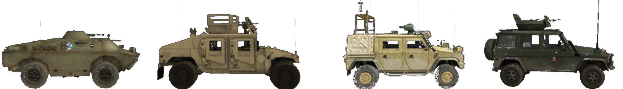

* **Civilian vehicles:** PR:BF2’s insurgent forces have access to a range of civilian cars and technicals mounted with machine guns, rocket-pods and SPG-9 recoilless rifles. They also have a flatbed with a mounted AA-gun, bomb trucks and bomb cars in their arsenal. 

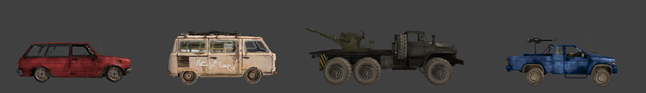

* **Truck:** come in both transport and logistic variants. The transport variant is capable of dropping 1 light supply crate and can fit an entire squad. The Logistic variant can only fit 2 soldiers and can drop 2 heavy supply crates, repair stations and Close Support Bridges \(more on this later\).

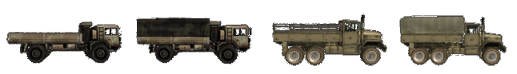

* **Armored Personnel Carrier \(APC\):** large armored vehicles more often than not armed with heavy weaponry. Often do not possess the force to defeat other heavy armored targets such as IFVs and tanks but are the best of all vehicles types at assisting infantry. Can fit 2 crewman \(driver and gunner\) and up to 6 soldier passengers.

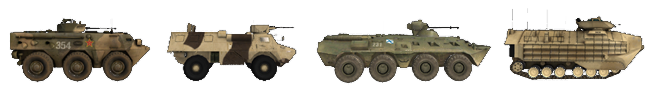

* **Infantry Fighting Vehicle \(IFV\):** Better armed and stronger than most APCs with often capabilities to defeat heavy armored targets using AT-Missiles. Are not always capable of transporting infantry. Under this category often also fall the recon-vehicles.

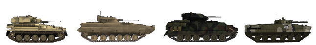

* **Anti-Tank Missile Mounted Vehicle \(ATM\):** The name speaks for itself. These are vehicles armed with AT-missiles to destroy other armored vehicles. Cannot transport infantry.

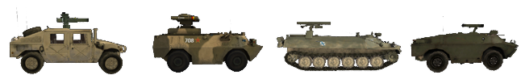

* **Tank:** Our heaviest of armored vehicles. They come equipped with AP, HE and COAX weaponry.

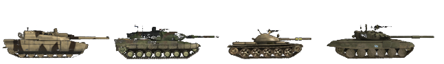

* **Anti-Air Vehicle:** These are usually light armored vehicles with only the ability to take out enemy aircraft and helicopters. They can use missiles or/and heavy guns.

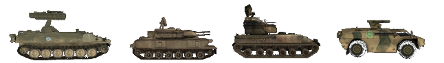

* **Boat:** PR:BF2 has a variety of boats both armed and un-armed.

* **Transport Helicopter:** These helicopters usually come equipped with door-guns for the mounted infantry to use.They are also capable of dropping heavy supply crates. There are light, medium and heavy transport choppers. See the section on Supply Crates to read on which variant has which crates available to it.

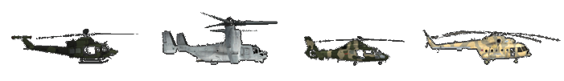

* **Attack Helicopters:** These helicopters come equipped with machine-gun pods and a variety of rockets and missiles. There are light, medium and heavy variants. Recon helicopters with the ability to laze targets and use their thermal cameras also fall under this category in PR:BF2. They are not always armed.

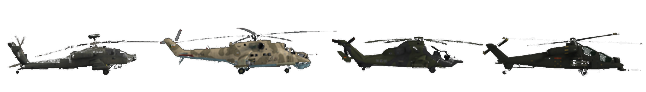

* **Jets:** PR:BF2 has a wide variety of jets. There are light and heavy attack jets, fighter jets, bombers and fighter-bombers.

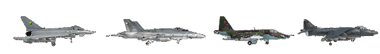

All friendly vehicles are marked on the map with unique icons for easy identification.

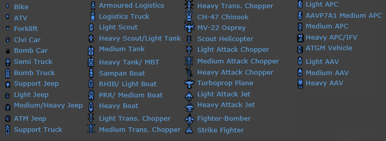

* If a team vehicle asset is destroyed it incurs a ticket penalty:
  * Jeep or truck: **2 tickets**
  * Transport helicopter: **5 tickets**
  * APC/AAV/RECON: **5 tickets**
  * Tank or IFV: **10 tickets**
  * Jet or attack helicopter: **10 tickets**
* Vehicles are **Team Locked** and you cannot operate enemy vehicles of any kind.
* Vehicles can only **be entered from appropriate positions** on the hull.


Vehicle entry points can differ per vehicle. Look for hatches.


* Normal soldiers are allowed to drive small unarmored vehicles such as jeeps, trucks and boats without the need for any specialized kit. If you require **a crewman or pilot kit** to operate a vehicle position, you will receive a warning message upon entering it and the screen will fade to black. If you do not exit the vehicle position within a few seconds, you will die.
* When exiting **a moving or burning vehicle** you will become wounded and possibly die. The faster the vehicle moves the greater the chance of death.
* **Destroying vehicle wrecks** does not influence score although a warning message states otherwise when shooting friendly wrecks.
* When manning **stationary or vehicle weapons** it takes a specific warm up time before they have the ability to fire:
  * MG: **5 seconds**
  * Anti-Air Missile: **5 seconds**
  * AT-emplacement: **10 seconds**
  * Armor main cannon: **30 seconds**
* Most Stationary AT-Weapons have optics with fixed zoom capability. Some of them even offer thermal optics.
* Exiting vehicles in mid-air and falling into water from high altitudes will injure you and may result in your death.
* Players can **request kits** from a APC’s/IFV’s entry position.
* Armored vehicles are more vulnerable when attacked from their flanks. The armor on the rear of the vehicle is the weakest. A single well-placed anti-tank projectile can disable or take them out.
* On public servers (not in local gamemodes) you can quickly switch to the next available free seat in a vehicle by pressing **F8**.
* When in a vehicle, you can see the information on the occupied seats in the bottom left of the the HUD. It shows only important crew seats as squared markers. This includes driver and gunner positions. Passenger seats do not have such markers and are shown as a seperate counter.


Important crew members are shown as squared markers. Passengers use a total counter above the vehicle icon.


