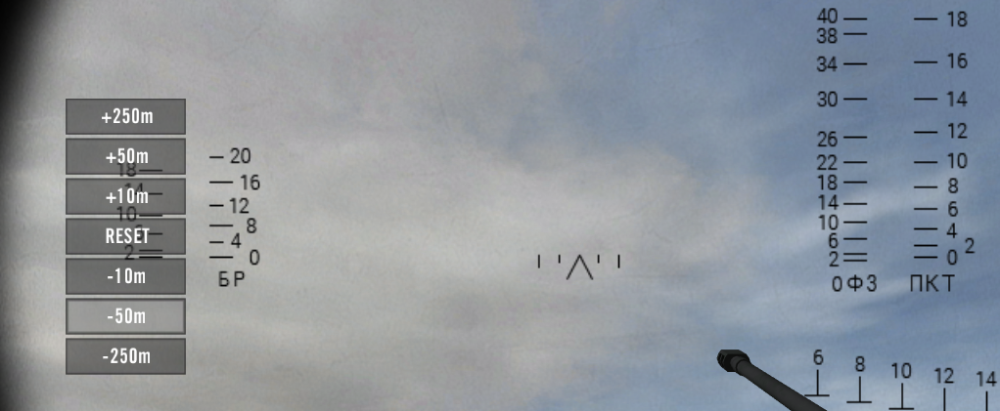
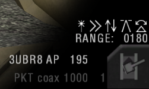

# Mengoperasikan Kendaraan

## _Informasi Umum Kendaraan_ {#general-vehicle-information}

* Kendaraan ringan, truk dan perahu & hampir semua jeep (kecuali yang berlapis baja ringan) dapat dioperasikan oleh semua prajurit. Kendaraan lapis baja (_Armored Vehicles_), helikopter, dan pesawat terbang membutuhkan kit kendaraan yang spesifik untuk mengoperasikannya. Pemain tak bisa mengendarai kendaraan maupun menggunakan senjata kendaraan jika tak mengenakan kit yang tepat. Anda tak bisa memasuki atau mengoperasikan kendaraan musuh. Untuk kendaraan darat, dibutuhkan **Crewman** kit. Sedangkan bagi helikopter & pesawat terbang adalah **Pilot** kit. Dua kit tersebut bisa diminta/diperoleh melalui kendaraan ataupun _supply crate_.
* _External view_ untuk kendaraan telah dihilangkan. Namun beberapa kendaraan terdapat kamera tersendiri seperti truk yang dapat melihat ke belakang **(C)**.
* Anda dapat **mengubah bidikan (_sight_)** MG (_Machine gun_) yang stasioner maupun terpasang di kendaran dengan menekan tombol ubah kamera **(C)**.
* Senjata otomatis yang terpasang di kendaraan seringkali mengalami **panas yang berlebihan (_overheating_)**. Perhatikan fitur heat-HUD di pojok kanan bawah. 
* MG (_Machine gun_) yang terpasang di kendaraan menggunakan sabuk amunisi. MG tersebut terisi secara otomatis tapi dengan jumlah terbatas.
* Kendaraan dapat **disuplai ulang & direparasi** di _supply depot_. Atau mempergunakan repair drop yang bisa disediakan dari truk logistik mana pun. Helikopter dan pesawat terbang akan secara otomatis direparasi dan disuplai ulang di lokasi spawn.
* Insurgent mempunyai **suicide vehicles** seperti truk sampah oranye atau mobil sipil (_Civilian_) yang dilengkapi dengan C4. Pemain dapat meledakkannya dengan tombol tembakan alternatif.
* Ketika keluar dari kendaraan yang sedang melaju, pemain menerima damage tergantung dari kecepatan melaju. Pemain akan terluka parah jika keluar dari kendaraan yang terbakar.
* Ketika kendaraan mengalami banyak kerusakan, memicu kemungkinan kendaraan tidak dapat melaju atau menggerakkan turret mereka hingga direparasi penuh.
* Kendaraan yang menembakan **wire-guided missile** perlu menunggu selama 7 detik sebelum bisa menembak.
* Mengganti senjata kendaraan (jenis peluru) biasanya menimbulkan delay sebelum Anda bisa menembak lagi.
* Anda dapat memakai **CTRL Kiri+Gerakan mouse** untuk freelook ketika mengoperasikan kendaraan layaknya helikopter, pesawat terbang, jeep, perahu serta truk. APC dan IFV tidak memiliki fitur ini sebab telah memiliki kamera khusus tersendiri.
* Di _public server_ (bukan _local game_) anda bisa ganti posisi duduk yang kosong di dalam kendaraan dengan menekan **F8.**
* Ketika di dalam kendaraan, anda dapat melihat informasi tentang kursi yang ditempati di kiri bawah HUD. Ini hanya menunjukkan kursi kru penting diberi penanda. Ini termasuk posisi pengemudi dan penembak. Kursi penumpang tidak memiliki penanda seperti itu dan ditampilkan sebagai penghitung terpisah.

## _Kendaraan Lapis Baja/Armored Vehicle_ {#armored-vehicles}

* Tank serta IFV memiliki kursi _driver_ & _gunner_ yang terpisah. Untuk menggunakan posisi _gunner_, seorang _driver_ atau _cupola gunner_ wajib ada. Setelah berpindah ke kursi _gunner_, Anda harus menunggu 30 detik sebelum bisa memakai meriam secara penuh.
* _Driver_ dan _gunner_ harus berada di squad yang sama.
* _Driver_ tank dan beberapa APC/IFV mempunyai **mode tampilan komandan (_commander view mode_)** yang memberikan tampilan 360° di sekitar turret. Mode ini bisa diakses dengan menekan tombol 2.
* _Driver_ dan _gunner_ dapat menge-**zoom** tampilan mereka dengan menekan tombol memunculkan asap **(X)**. Beberapa tank driver mulanya harus beralih ke tampilan komandan (_commander view_).
* Hampir semua tank serta IFV dapat menggunakan **optik termal (_thermal optics_)** sebagai tambahan pada tampilan normal. Anda bisa berganti ke mode termal dengan memakai menu radio kedua **(T)** lalu pilih **“DAY/THERMAL”**. Beberapa juga memperbolehkan untuk bertukar antar varian termal seperti WHOT/BHOT.

> 
>
> Pencitraan Termal

* Kendaraan lapis baja (_Armored vehicles_) tak memiliki suara peringatan ketika dibidik oleh peluncur roket maupun rudal yang tengah ditembakkan ke arah mereka.
* Kendaraan lapis baja (_Armored vehicles_) mempunyai material yang realistis. Yang berarti pelindung di bagian depan serta turret lebih kuat dibandingkan dengan bagian atas dan bagian belakang kendaraan. Sisi samping kendaraan serta roda rantai (_tracks_) biasanya memiliki ketahanan yang cukup mumpuni terkait kekuatan pelindung.
* Tank dan IFV rata-rata memuat sampai dengan 4 jenis amunisi:
  * **Armor-piercing (AP)**: Untuk menyerang kendaraan lapis baja musuh.
  * **High Explosive (HE)** (Tekan tombol 2): Efektif berhadapan dengan sasaran ringan (jeep, rumah, helikopter, prajurit yang tengah bersembunyi, dll.)
  * **Anti-tank missiles** (Tekan tombol 3): Digunakan untuk menghadapi sasaran (lapis baja) berat.
  * **Co-axial MG** (Tekan tombol tembakan alternatif): Digunakan untuk menghadapi serdadu/prajurit.
* _Driver_ tank atau _gunner_ (tergantung pada kendaraan) serta kendaraan tertentu lainnya bisa **melontarkan bom asap (_smoke_)** dengan menekan tombol tembakan alternatif.

_Gunner_ Tank & IFV memunculkannya dengan memilih slot senjata itu (umumnya tombol 3) dan menekan tombol tembak untuk melontarkan rentetan bom asap. Masing-masing dapat melontarkan 2 rentetan (_Gunner_ harus menunggu jeda 60 detik antar rentetan).

* Di beberapa kendaraan, bom asap akan memblokir inframerah alias **IR-blocking** yang juga turut memblokir pencitraan termal. Sementara (kendaraan lawas) lainnya, pemain bisa melihat jelas dalam asap pada penglihatan thermal.

> 
>
> Kendaraan melontarkan asap (_smoke_)

## _Helikopter_ {#helicopters}

* Helikopter memiliki waktu pemanasan mesin sekitar 30 detik. Jika terlalu banyak _thrust_ selagi memutar _rotor_ atau baling-baling, pilot akan kehilangan kendali dan helikopter akan jatuh. Untuk menerbangkan helikopter, Anda harus membiarkan helikopternya menyala saja setidaknya selama 30 detik sebelum helikopter lepas landas.
* Pilot helikopter bisa melihat arah yang lain selama terbang dengan menekan tombol 6, 7, 8, dan 9 yang bisa digunakan ke _joystick POV HAT Switch._ Untuk melihat ke depan lagi, tekan tombol 1 atau pilih persenjataan apapun yang dimiliki kendaraan.
* _Rudder control_ sangat efektif di kecepatan rendah. Pada kecepatan tinggi, Anda harus memiringkan helikopter untuk belok.
* Player dengan **kit pilot tidak bisa mengambil kursi penumpang** helikopter. Hal ini untuk dilakukan untuk menghentikan player dengan kit pilot sekaligus dengan kit pasukan khusus (SF paratrooper assault kit) karena kit pilot memiliki parasut. Jika Anda telah keluar dari helikopter dan menerima jemputan helikopter lain, pastikan kamu menjatuhkan kit pilot mu sebelum memasuki kursi penumpang helikopter lain, kalau tidak Anda akan dipaksa keluar dari helikopter.
* Pilot helikopter serang atau _Gunship_ dapat menembakkan roket _unguided_ dan _gunner_ mengendalikan _cannon_ dan rudal _guided_.
* _Gunner_ helikopter serang dapat _zoom_ di kamera persenjataan dengan menekan tombol kamera (C) atau menekan tombol F9 sampai F11. _Gunner_ juga bisa berpindah ke mode gambar _thermal_ menggunakan dengan menekan tombol menu radio sekunder (T) dan pilih “DAY/THERMAL” untuk beralih antara keduanya.
* _Gunner_ helikopter serang memiliki 4 mode yang berbeda untuk dipilih:
* Kamera _first-person_ dalam kokpit
* Kamera senjata yang mengendalikan persenjataan helikopter
* **Mode penembakan _Laser-guided_ (LG) atau panduan laser** untuk melakukan mode pembidikan semi-manual, dimana anda dapat klik pada sasaran dan rudal akan meluncur sesuai panduan laser menuju titik sesuai yang diinginkan dan klik lagi untuk mengunggah lokasi sasaran ke rudal yang mengudara.
* **Mode penembakan _Laser-targeted_ (LT) atau bidikan laser** (fire-and-forget) untuk mengunci rudal pada bidikan laser yang dilakukan pasukan darat atau helikopter intai. Mode bidikan laser merupakan pilihan terbaik jika _spotter_ dapat menandai sasarannya. Hal ini dapat meminimalkan paparan helikopter itu sendiri. Mode panduan laser merupakan pilihan terbaik untuk sasaran bergerak. Namun jika sasaran tersebut belum ditandai laser dengan benar atau buruk, atau sederhananya rudal tidak dapat melihat sasaran tanpa alasan apapun setelah rudal diluncurkan atau ada bangunan yang menghalangi, rudal tersebut dapat meleset.
* Kru helikopter harus berada di squad yang sama.
* Helikopter harus kembali ke _helipad_ dan mendarat untuk mengisi ulang peluru dan melakukan reparasi. Di kapal induk, Anda hanya bisa mengisi ulang peluru di _ramp_ luar landasan pacu, ini tidak termasuk tumpangan.
* Untuk menjatuhkan suplai dengan sukses dari helikopter angkut, pilot diharuskan untuk menjatuhkan suplai dari ketinggian 5 meter dengan menekan tombol _alternate fire._
* **_Flare_ pengecoh** yang dimiliki hanya terbatas dan butuh isi ulang setelah dipakai. Setiap kali anda mengeluarkan _flare_ (X), 1 _flare_ akan terpakai.

## _Pesawat Terbang_ {#fixed-wing-aircraft}

* Pesawat memiliki waktu pemanasan mesin selama 30 detik sebelum lepas landas.
* Pilot jet dapat melihat ke arah yang lain selama terbang dengan menekan tombol 7, 8 dan 9 yang bisa digunakan ke _joystick POV HAT Switch._ Untuk melihat ke depan lagi tekan 1 atau pilih persenjataan apapun yang dimiliki pesawat.
* Untuk **_taxi_** di darat, tahan _throttle_ di posisi _neutral_/netral dan dorong stik ke depan atau tekan tombol atas untuk pelan-pelan terbang ke arah tersebut. Tarik stik ke belakang atau tekan tombol bawah untuk mundur. Untuk belok kiri dan kanan, gunakan _rudder control_ **(A&D)**.
* Ketinggian maksimum hanya 10 km.
* Untuk **lepas landas** Anda harus memberikan _throttle_ maksimum lalu tunggu sebentar untuk memberikan akselerasi pada pesawat. Ketika Anda berada di ⅔ landasan pacu, mulai tarik stik dengan pelan dan tambahkan _afterburner_.
* Kebanyakan pesawat dipersenjatai dengan **_cannon_ dan beberapa persenjataan eksternal.** Tombol _primary fire_ akan menembakkan _cannon_ (kalau ada) sementara tombol _alternate fire_ akan menembakkan persenjataan yang sedang dipilih seperti bom atau rudal.
* Untuk mengisi-ulang Anda harus mendarat di pangkalan udara dan _taxi_ sampai _ramp_ atau landasan pacu untuk sebagian kecil map. Butuh waktu untuk mengisi-ulang sampai benar-benar penuh. Pada kapal induk, Anda hanya bisa mengisi-ulang di _ramp_ luar landasan pacu. Ini tidak termasuk tumpangannya.
* Kebanyakan pesawat memiliki fitur **kursi lontar** saat menekan tombol E. Ini akan mengeluarkan parasut secara otomatis di bawah ketinggian 750m.
* **Senjata Udara-ke-Darat** di pesawat 1 awak membutuhkan kuncian laser untuk mengenai sasaran. Prosedur yang direkomendasikan untuk melakukan serangan dijelaskan berikut:
  1. Pasukan darat mencari sasaran yang cocok untuk serangan udara.
  2. Pasukan tersebut melakukan kontak/menghubungi pilot baik secara langsung lewat mumble/text chat atau dengan menempatkan marka CAS. 
  3. Pilot menginformasikan pasukan darat kedatangannya menggunakan respon “ON THE WAY” dari menu radio utama atau melalui mumble/text chat.
  4. Ketika pilot mendekati sasaran, pasukan darat menandai sasarannya dengan **GTLD laser designator**, jika laser tersebut sedikit keluar sasaran, rudal kemungkinan akan meleset.
  5. Ketika sasaran sudah dikunci, pilot akan mendapatkan isyarat suara. Dia bisa menjatuhkan bom atau menembakan rudal.
* **Pesawat awak 2** memberikan akses _Weapon System Officer_ (WSO) untuk mengidentifikasi dan melakukan penyerangan pada sasaran dengan menggunakan mode pembidikan TV (_TV Targeting mode_). Mode tersebut berfungsi yang sama dengan yang di helikopter.
* Komandan dapat menandai sasaran laser dari map. Karena metode ini kurang presisi, sebaiknya digunakan untuk mengebom sasaran statis/tidak bergerak.
* Pesawat tidak memiliki  kamera depan tapi Anda bisa melihat ke belakang dengan menekan tombol kamera (C) atau F11 untuk melihat ke belakang atau F9 untuk kembali melihat ke depan.
* **_Flare_** digunakan satu-satu (X) dan butuh isi-ulang setelah semuanya dikeluarkan. Karena suara peringatan keluar muncul ketika musuh sepersekian detik sudah mengunci pesawat Anda, direkomendasikan untuk menggunakan _flare_ selagi menyerang musuh untuk mengurangi kesempatan musuh dalam mengunci.
* **Untuk mendarat** di PR:BF2 Anda harus merencanakan terlebih dahulu dibandingkan di BF2. Berikut adalah beberapa tips untuk melakukan pendaratan pertama dengan mudah:
* Anda harus mengurangi kecepatan sampai tetap sejajar tanpa harus jatuh (tenaga sekitar 40%) dengan kecepatan _stalling_ berbeda-beda setiap pesawat. (Anda bisa mencari tahu kecepatan _stalling_ pesawat yang diterbangkan dengan cara terbang tinggi ke atas lalu memperlambat pesawat sampai hilang kendali dan menukik, tetapi menerbangkan tinggi ke atas berarti anda mengembalikan kendali dengan membuka _throttle_ and mengarahkan pesawat ke bawah, lalu tetaplah berada di atas kecepatan _stall_ ketika mendarat, sampai roda pesawat menyentuh darat.)
* Ketika Anda berada di kecepatan ini, mulailah terbang mendekati arah pangkalan udara.
* Bayangkan sebuah titik di map yang jaraknya 1 km dari landasan pacu.
* Terbang ke titik tersebut lalu belok menuju landasan pacu.
* Saat sudah berada sekitar 200 m dari landasan pacu, lepas _throttle_.
* Sekali pesawat sudah berada di darat, tarik stik untuk memperlambat, pesawat pun akan melambat dengan sendirinya.

## Sistem Pengendali Tembakan (_Fire Control Systems_) {#fire-control-systems}

Kendaraan di Project Reality menggunakan sistem balistik yang realistis kpada peluru ranpur. Tergantung pada kendaraannya, beberapa variasi komputer Sistem Pengendali Tembakan (_FCS_) dapat digunakan oleh penembak. Pada prinsipnya, _FCS_ dapat menghitung penyesuaian yang diperlukan untuk menembak kepada target tepat yang diinginkan. Solusi penembakan tidak hanya mempertimbangkan jatuhnya peluru karena gravitasi, ini juga memperhitungkan gaya gesek dari udara yang memperlambat peluru. Selanjutnya offset dapat dihitung antara kamera operator dan laras senjata, perbedaaan ketinggian target, kemiringan serta kecepatan kendaraan. Sama seperti kehidupan nyata, tidak semua kendaraan mempunyai kemampuan _FCS_ yang sama. Bagian ini akan mempelajari lebih lanjut pada beberapa kasus penggunaan implementasi _FCS_ kami.

### Kendaraan Darat

* Singkatnya, terdapat 3 tipe _FCS_ untuk kendaraan darat:
  * _Static sight_: kamu harus mengandalkan penanda jarak dibidikan.
  * _Adjusting sight_: crosshair akan menandakan dimana harus membidik.
  * _Adjusting barrel_: laras akan menyesuaikan dimana posisi yang kamu arah.
* Pandangan juru tembak (_HUD_) akan bervariasi tergantung dari spesifikasinya. Beberapa kendaraan, umumnya kendaraan generasi terdahulu, tanpa dibatasi dengan usia, hanya menampilkan _graticule overlay_ (tampilan bidikan baru) dengan garis menunjukkan poin penting bidikan yang diperlukan pada jarak tertentu.
* Kendaraan lain mampu untuk setel bidikan laras ke nol untuk menandakan poin bidikan pada arah tembakan. Dengan menahan _commo-rose_ **\(_default_: Q\)**, penembak dapat mengatur ke jarak yang diinginkan dengan menaikkan atau menurunkan indikator jarak Penembak juga dapat menyetel ulang bidikan ke posisi semula, yang ditandai dengan - - - pada tampilan jarak pada _HUD_.

> 
>
> Gunakan _commo-rose_ untuk mengganti jarak secara manual.

* Penyetelan paling rumit yang ada di sebagian besar kendaraan modern dilengkapi dengan akses _FCS_ yang sepenuhnya otomatis, lengkap dengan _laser range finder_. .
* Setelah membidik _crosshair_ pada jarak yang diinginkan, kendaraan dengan _laser range finder_ dapat digunakan dengan cara mengubah sudut pandang kamera **\(_default_: C\)** yang akan mengarahkan laras senjata ke tengah _crosshair_ secara otomatis.
* Pada pojok kanan bawah HUD, terdapat tampilan jarak dan kemampuan lainnya saat ini.

> 
>
> Jarak yang disetel dan ikon kemampuan _FCS_ berada di sebelah kanan _HUD_.

* Ada beberapa ikon di pandangan penembak di kendaraan ber-_FCS_ yang bisa berwarna putih atau abu-abu. Setiap ikon ini mengindikasikan berbagai tipe koreksi bidikan yang akan dilakukan _FCS_ saat mengatur meriam dengan benar. Koreksi akan dilakukan untuk ketidak akuratan dalam pembidikan berikut:
  *  Kompensasi kecepatan: Mengkompensasi kecepatan kendaraan sendiri. TIDAK mengoreksi bidikan penuntuk untuk kendaraan musuh yang bergerak.
  *  Kompensasi ketinggian: Mengkompensasi perbedaan ketinggian antara kendaraan dan sasaran.
  *  Kompensasi paralaks: Mengkompensasi ketidakselarasan antara posisi meriam dan posisi kamera penembak.
  *  Kompensasi kemiringan: Mengkompensasi saat kendaraan berada miring di sudut tertentu.
* Saat mengganti ke senapan mesin _coaxial_, meriam utama secara otomatis akan mengganti _pitch_ agar tembakan berada tepat di tengah. Hal yang sama akan terjadi saat mengganti ke tipe amunisi lain. Untuk berganti antara meriam utama dan senapan mesin _coaxial_ gunakan tombol ganti senjata **\(default: F\)**.
* Walaupun mode operasi yang paling mudah adalah yang senjata disetel otomatis, sang penembak tetap bisa mengaturnya secara manual. Namun hal ini tidak akan mengoreksi perbedaan pembidikan (lihat bawah).
Jika jarak ke sasaran lebih jauh dari kemampuan sang senjata, _HUD_ akan mewarnai tulisan setelan jarak dengan warna merah atau **^ ^ ^ ^** sebagai indikator kesalahan.
* Sebagian kecil kendaraan akan menggunakan alat penaksir jarak (_laser rangefinder_) untuk mencari jarak ke sasaran, tapi senjata tidak akan bergerak agar bidikan tetap berada di tengah, tapi posisi _crosshair_ di scope akan ganti. Mengganti ke senapan mesin _coaxial_ atau tipe amunisi lain juga akan mengganti posisi _crosshair_ secara otomatis. Seperti diatas, penembak juga bisa menyetel secara manual.
* Ada periode yang sangat sangat singkat setelah mengukur jarak untuk senjata memasukkan setelan yang tepat. Jika anda terlalu cepat, kamu bisa meleset.
* Laser _rangefinder_ memiliki interval beberapa detik dimana dia tidak bisa digunakan, diindikasikan dengan iconnya berubah menjadi merah.
* Laser _rangefinder_ tidak bisa digunakan untuk mengatur senjata jika jarak ke sasaran kurang dari 150 meter. Mencari jarak ke sasaran yang dekat atau jauh di langit akan membuat senjata kembali ke posisi netral dan indikator jarak akan menunjukan  **v v v v**.
* Laser _rangefinder_ memiliki _margin of error_ kira-kira 5 meter.
* _Game_ akan mengingat settingan terakhir juru tembak, tidak peduli jika dia meninggalkan kendaraan atau mati di dalam kendaraan.
* Pemanasan meriam utama tidak menghentikan penembak menggunakan laser _rangefinder_ atau penyetelan jarak secara manual.
* _FCS_ di kendaraan artileri pertahanan udara (arhanud/_SPAAA_) selalu aktif dan tidak perlu _input_ apapun dari pemain.
* Saat menjadi kru kendaraan artileri pertahanan udara yang memiliki radar, _FCS_ akan menampilkan lingkaran yang menandakan bidikan sasaran penuntun setelah sukses mengunci sasarannya. Pesawat musuh akan menggunakan _flare_ untuk mengganggu kuncian, yang akan menghilangkan lingkaran sasaran sementara.

### Fixed Wing Aircraft

_FCS_ tidak hanya terdapat pada kendaraan darat saja, pesawat terbang juga memiliki versi _FCS_ sendiri untuk solusi penembakan (otomatis). Dengan demikian, jet modern menggunakan _Constantly Computed Impact Point_ (_CCIP_) yang akan menunjukkan di mana bom akan mendarat di tanah. Selain itu, _ground attack jet_ juga akan menunjukkan efek dari senjata utama mereka. _Fighter jet_ yang memiliki penargetan radar akan dapat mengunci target pesawat dengan senjata mereka untuk menunjukan penanda yang memprediksi ke mana harus membidik dan menembak targetnya. Penguncian radar ini juga akan memicu peringatan radar korban dan dapat dilawan menggunakan _flare_.
