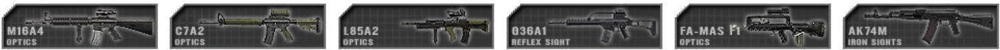

# Senjata dan Perlengkapan

## _Senjata dan Perlengkapan Secara Umum_ {#general-weapons-equipment}

Senjata setelah melakukan gerakan yang berlangsung lama, terkadang diperlukan beberapa saat untuk mengembalikan presisi dan kemampuan untuk menembak secara akurat pada sasaran jarak jauh. Pertempuran pada jarak dekat tidak akan terpengaruh dengan penyimpangan gerakan. Hal ini memungkinkan pemain untuk melakukan sedikit pengoreksian posisi  tanpa mengurangi akurasi senjata. Tiarap akan mengurangi akurasi pemain untuk beberapa saat tetapi dapat memberikan akurasi tertinggi saat melakukan pertempuran pada jarak jauh setelah penanda akurasi pemain pulih.

Kebanyakan senjata diatur ke semi-otomatis secara default.

Senjata harus diisi kembali secara manual (default: **R**). Menyimpangnya senjata tidak terpengaruh pada optic atau sight yang dipakai. Senjata diklasifikasikan ke beberapa kategori di PR:BF2, pada umumnya terkait pada kit yang digunakan:

**Assault Rifle** biasanya tersedia pada beberapa varian dengan alat bidik yang berbeda. Membidik dengan optik yang diperbesar biasanya mempunyai kelebihan di akurasi tetapi mengurangi luasnya penglihatan oleh optik pada di samping optik jika dibandingkan dengan _reflex sight_ atau _iron sight._

> _Kit: Semua kit yang tidak menggunakan senjata utama yang lain atau tidak bersenjata._

**Underbarrel grenade launcher (UGL)** dipasang di bawah senjata dan digunakan untuk mengenai sasaran yang tidak dapat dijangkau dengan tembakan langsung (_direct fire_). UGL juga efektif jika digunakan untuk mengenai kendaran yang tidak memiliki lapis baja dan efektif pada jarak 200 meter dan lebih. Granat juga harus menempuh 28m sebelum granat tersebut dapat meledak, jika tidak granat tidak akan meledak. UGL juga dapat digunakan untuk meluncurkan granat asap (_smoke grenade_) yang dapat digunakan untuk menghalangi pandangan musuh. Jarak peluncur dapat diatur dengan _ladder sight_ yang terpasang pada senjata. Ketika membidik, gunakan tombol radio menu utama (default: Q) dapat digunakan untuk mengatur jarak ke sasaran (lihat Mengubah Jarak Sight). Ketika menembak sasaran yang lebih tinggi atau rendah daripada jarak yang telah ditentukan [\(lihat Mengubah Jarak Sight\)](weapons_and_equipment.md#altering-sighting-range), hal ini sangat penting untuk diperhitungkan terlebih dahulu. Pada map malam (_night map_), grenadier juga mendapatkan amunisi flare (_flare rounds_).

> _Kit: Grenadier_

**Side Arms** biasa digunakan oleh pemimpin squad pasukan konvensional untuk senjata cadangan dan sebagai petanda otoritas. Sniper juga dipersenjatai dengan pistol untuk pertahanan diri sendiri ketika sedang berpindah tempat. Sebagian insurgent tidak mempunyai senjata utama melainkan menggunakan senjata cadangan.

> _Kit : Officer, Sniper, Pilot, Cell Leader, Vietnam Grenadier, dan bermacam kit insurgent._

**Shotguns** sangat berbahaya ketika digunakan pertempuran jarak dekat. Mereka juga bisa digunakan untuk membuka pintu dan gerbang yang terkunci. _Insurgent Civilians_ bisa ditangkap dengan menggunakan peluru _buckshot_ yang mensimulasikan melumpuhkan informan dengan menggunakan peluru karet. Beberapa shotgun menggunakan peluru _breaching_ yang hanya bisa gunakan untuk membuka pintu yang terkunci.

> Kit : _Rifleman Breacher_ di pasukan konvensional. Insurgent / Hamas / Taliban / Militia

**Designated marksman rifles (DMR)** dipakai untuk menyerang sasaran jarak jauh dengan akurasi yang tinggi. Mereka bisa ditaruh untuk meningkat akurasi, tapi menurunkan mobilitas. Posisi pemain mempengaruhi akurasi jarak jauh saat DMR ditaruh, dan posisi penembakan yang optimal adalah tiarap. Ketika menembak dengan jarak sasaran sampai 600m anda diperlukan memperhitungkan dimana peluru akan jatuh. Hal itu harus dilakukan juga untuk memperhitungkan sasaran yang sedang bergerak pada jarak jauh.Untuk memaksimalkan akurasi senjata ini harus menunggu beberapa detik per satu peluru yang ditembakan.

> _Kits: Marksman_

**Sniper rifles** digunakan untuk menyerang sasaran dari jarak jauh. Kecepatan menembaknya sangat lambat dikarenakan menggunakan _bolt action_. Posisi pemain sangat mempengaruhi akurasi dari senjata ini.Memperhitungkan jatuhnya peluru diperlukan saat posisi sasaran melebihi 600m. Maksimum akurasi dapat dicapai dengan menunggu 8 detik setelah bergerak dan 4 detik setelah menembak. _Switch fire mode_ (default 3) bisa digunakan untuk menstabilkan nafas anda yang bertahan hingga 8 detik. Dengan ini bisa membantu anda memperkirakan waktu yang dibutuhkan untuk mendapatkan akurasi. Menahan tombol klik-kiri setelah menembak akan melihat tembakan anda sebelum  mengokang kembali.

> _Kits: Sniper_

**Sub machine guns (SMG)** digunakan untuk pertempuran jarak dekat. Kecepatan menembaknya sangat cepat dan kebanyakan menembakan peluru pistol seperti peluru berkaliber 9mm, meskipun ada pengecualian. Beberapa _submachine guns_ termasuk klasifikasi _personal defense weapon_ (PDW) yang biasanya mempunya barel yang lebih pendek dan memberikan pemakai lebih mudah untuk bergerak dan mudah dibawa. Senjata ini bisa dipakai saat bergerak dengan sedikit penyimpangan tapi dibatasi oleh jarak jangkauan efektif.

> Kit : _Crewman, Rifleman AT, Heavy Antitank, Squad Leader, Rifleman Breacher_ di pasukan konvensional

**Light machine guns (LMG)** digunakan untuk melakukan _suppression_ pada musuh dan bisa menghancurkan squad musuh ketika digunakan di jarak menengah atau di situasi penyergapan. Mereka dapat ditaruh untuk memberikan akurasi tambahan,stabilitas dan jarak yang sangat bagus. Ketika menggunakan LMG yang sedang ditaruh (deploy), akurasi akan meningkat tapi mobilitasnya berkurang dan tidak cocok untuk digunakan jika sedang bergerak. Posisi pemain juga tidak mempengaruhi akurasi jarak jauh dan posisi yang optimal menggunakan posisi tiarap. Di posisi ini anda akan mendapatkan akurasi terbaik untuk jarak jauh. _Un-deployable mode_ dapat digunakan pemain saat bergerak dan dibutuhkan untuk segera menembak tanpa tertunda saat jarak dekat.

> _Kits: Automatic Rifleman_

**Medium machine guns (MMG)** merupakan senjata _machine gun_ kelas menengah. Mereka menggunakan kaliber yang lebih besar yaitu 7.62mm memiliki efek penghancur di dalam situasi tertentu dan sangat bagus untuk melakukan _suppression_ pada musuh dari jarak jauh, dan senjata ini dibatasi dengan hanya memiliki mode _deployable_ dan 10 detik untuk bisa mendapatkan akurasi yang optimal.

> _Kits: Machine Gunner_

**Fragmentation grenades** memiliki radius ledakan yang besar tapi tidak akurat ketika dilempar saat bergerak atau loncat dan jangkauan lemparnya relatif pendek. Menunggu sekitar 5 detik hingga akhirnya meledak. Beberapa granat seperti RGO dan RKG akan meledak ketika terbentur. Granat RKG juga merupakan contoh granat yang dapat digunakan untuk melawan kendaraan. Melempar batu hanya memberikan sedikit luka pada pemain tetapi sangat berbahaya jika terkena lemparan batu berkali-kali. Untuk memperingatkan teman anda sebelum melempar granat anda bisa menggunakan radio utama (default: Q) ketika sedang memegang granat untuk meneriakan sebuah peringatan atau alternatifnya gunakan mumble.

> Kit: _Grenades: kebanyakan di kit infanteri, terutama Officers dan rifleman_| _batu: sipil dan beberapa insurgent_

**Knifes & Bayonets** sangat berbahaya dapat membunuh musuh secara instan. Membunuh insurgent dengan menggunakan pisau  akan menangkapnya. Menyerang dengan menggunakan _unarmed melee_ butuh sekitar 5 kali pukulan untuk membunuh musuh.

> Kit: _Armed Melee: semuanya kecuali pilot, sipil dan unarmed Unarmed Melee: Pilot dan Unarmed_

**Light anti-tank launchers (LAT)** digunakan untuk melawan kendaraan tanpa perlindungan dan kendaraan lapis ringan. Mereka tidak efektif untuk melawan kendaraan ber-armor sedang dan berat. Pengguna senjata ini butuh mempersiapkan senjatanya dengan berdiri selama 4 detik sebelum anda dapat mencapai akurasi yang optimal. Tergantung dari peluncur yang anda pakai, akan berbeda cara pemakaiannya. Sebagian peluncur sudah terukur jaraknya sesuai bidikannya, dan yang lainnya bisa diatur jaraknya, tapi rata-rata mereka akurat hanya sampai jarak 500m. Untuk menembakkan secara efektif dari jarak tertentu dibutuhkan kemampuan dan perkiraan untuk mengenai sasaran. Jarak peluncur bisa diatur dengan menggunakan pengatur jarak yang terdapat di senjata  saat membidik. Untuk melakukan hal ini, tekan kunci radio utama _commo-rose_ (default: Q) dan pilih jarak tembak anda dengan scroll mouse. (lihat _Cara Mengubah Jarak Pandang_) Ketika akan menembakkan ke sasaran dengan jarak yang telah diatur, anda bisa mengatur sudut tembakan dengan manual, contohnya dengan sedikit menggeser ke atas atau bawah untuk menetapkan jarak efektif untuk menembak.

> _Kits: Rifleman AT, Militia / Taliban / Hamas Anti Tank_

**Heavy anti-tank launchers (HAT)** digunakan untuk melawan kendaraan yang lebih berat. Mereka dapat menghancurkan armor ringan dan berat dengan satu kali tembakan, sementara tank (MBT) perlu beberapa kali tembakan untuk dapat hancur. Efektivitas dari _heavy AT_ tergantung dimana anda mengarahkan tembakannya. Armor tank sangat lemah di bagian belakang dan di atas _turret_. Tentunya sisi terkuat tank adalah bagian depan. Untuk mempersiapkan senjata,dibutuhkan sekitar 10 detik tanpa bergerak sebelum ditembakan. Untuk melacak sasaran secara efektif anda perlu menembaknya dari jarak jauh, lagipula senjata tidak akan akurat ketika sedang melakukan pelacakan. Setelah penanda bidikan sudah berada di tengah anda akan siap untuk menembaknya. Sebagian peluncur diperlengkapi sistem kabel, yang anda dapat mengarahkan hulu ledak ke arah sasaran. Untuk melacak sasaran yang sedang bergerak, tahan tombol tembak (mouse kiri) sampai misil meluncur dan lacak terus hingga terkena sasaran. Beberapa HAT _unguided_ dan akan menembak langsung ke arah yang dituju dan beberapa tampilan bidikan tidak selalu ada. Sebelum menembak pastikan jarak anda dengan sasaran lebih dari 30 meter, jika tidak hulu ledak tidak akan menyala dan tidak akan meledak.

> Kit: _Pasukan konvensional Anti Tank_

**Surface-to-air missile (SAM)** digunakan untuk menembak jatuh pesawat musuh. Untuk melakukan hal tersebut anda perlu penglihatan secara visual untuk mengunci sasaran dengan melacaknya di udara. Ketika sudah dilacak dengan menstabilkan ke arah sasaran anda akan mendengar bunyi nada rendah, setelah beberapa detik ketika sudah dapat mengunci sasaran anda akan mendengar bunyi kedua dengan nada yang lebih tinggi, pada saat ini anda dapat menembaknya. Untuk menangkis serangan tersebut, perlengkapan seperti flare akan membuat anda sulit untuk menghancurkan sasaran tersebut, sudut serangan anda ke arah kendaraan tersebut sangatlah penting agar dapat menghancurkannya. Pilot musuh akan menerima bunyi peringatan beberapa detik setelah mereka dikunci oleh SAM, memberikan mereka waktu untuk bermanuver menjauh dari ancaman. Beberapa faksi yang jadul seperti faksi yang terdapat di Falklands akan menggunakan Blowpipe, Blowpipe sendiri tidak mempunyai fitur mengunci sasaran dan diperlukan pengendalian secara manual ke sasaran.

> _Kits: Anti Aircraft_

**Remote detonated explosives**adalah peledak yang diledakkan dengan perangkat pemicu jarak jauh oleh seseorang yang meletakkan peledak dan umumnya digunakan untuk menyerang dan bertahanan. **Anti-Personnel Mines**(_Claymores_) membutuhkan waktu sekitar 5 detik untuk aktif setelah dipasang. Saat memakai alat pemicu ledakan, akan ada suara yang menandakan berapa detik yang telah dihabiskan. Jika bahan peledak langsung dipicu setelah dipasang, mereka tidak akan meledak sama sekali. IED tidak punya pengaman seperti ini. Kebanyakan peledak harus dipasang dalam keadaan tiarap. Seorang player bisa meletakkan sampai 4 _AP mine_ dan 5 pak C4 atau IED secara serentak. Beberapa pemain bisa meletakkan dua kelompok peledak yang berbeda dimana bisa diledakkan masing-masing.Semua bahan peledak ini  dapat dijinakkan oleh kunci inggris milik _Combat Engineer._ Selama proses pemasangan, anda dapat meletakkan penanda di peta untuk pasukan tim anda dengan menekan **Q.** Anda dapat meletakkan sampai 3 penanda.

> _Kits: AP Mines: Rifleman AP \| Mine, Mortar, TNT IEDs: Sapper \| Water Container IED: Sapper and unconventional Engineer_

**Time detonated explosives** adalah peledak berwaktu yang meledak beberapa waktu setelah mereka dipasang dan umumnya digunakan untuk menghancurkan aset bangunan seperti FOB musuh, weapon cache insurgent dan kendaraan musuh yang ditinggalkan. Ada 2 jenis Peledak Waktu, yaitu **C4 Besar dan Kecil.** C4 Besar kekuatannya hampir dua kali lebih besar dari C4 Kecil dan hanya tersedia untuk Faksi Konvensional Kit _Combat Engineer_ sementara C4 Kecil dibawa oleh Faksi Konvensional Kit _Combat Engineer_ dan _Breacher_ .Anda hanya perlu memasang satu C4 Kecil atau Besar agar bisa menghancurkan sebuah FOB, satu C4 Kecil tidak bisa langsung menghancurkan sebuah FOB, tetapi akan ambruk setelah C4 diledakkan, memberikan waktu untuk tim oposisi agar bisa memperbaiki fob. Untuk menghancurkan pondasi fob atau bangunan lainnya, cukup pasang C4 Kecil lainnya di pondasi dan pondasinya akan langsung hancur setelah meledak. C4 Kecil juga dapat digunakan untuk menghancurkan kendaraan _yang sedang diam_, _dengan 1x C4 Kecil untuk menghancurkan kendaraan lapis baja ringan (_Land Rovers_, Mobil sipil, _Technical_, _lightly armoured HMMWVs_, dll.), 2x C4 Kecil untuk menghancurkan _Armoured Jeep_ dan Truk (Up-Armoured HMMWV, Panther CLV and Support & Logistics Trucks seperti M-35, dll.), 3x C4 Kecil untuk menghancurkan APC. C4 Besar dapat dijinakkan oleh_Spanner/Wrench Combat Engineer._

> _Kits: Small C4: Conventional Forces Combat Engineer & Breacher \| Large C4: Conventional Forces Combat Engineer_

**Mines (Ranjau)** adalah bahan peledak kontak yang dimiliki oleh _Combat Engineer._ Ranjau dapat dipasang dimana saja dan akan terlihat menonjol. Selama pemasangan anda bisa meletakkan penanda di peta untuk pasukan tim anda dengan menekan **Q**. Anda bisa meletakkan penanda hingga 3 penanda. Ranjau dapat dibuang dengan kunci inggris milik _Combat Engineer._

> _Kits: Combat engineer_

**Field Dressings** dapat mengembalikan darah 25%. _Field Dressing_ dilempar ke tanah untuk menyembuhkan pemain yang berdiri di dekatnya, _Field Dressing_ dapat dipilih dengan menekan tombol 8 atau 9. **First Aid Kit** dapat menyembuhkan pemain secara penuh dan dapat digunakan dengan menahan tombol untuk menembak dan arahkan ke seseorang yang terluka. _First Aid Kit_ tidak bisa dijatuhkan dan memerlukan beberapa saat untuk sembuh secara penuh pada pemain yang terluka parah. Seorang _medic_ bisa mengobati diri sendiri dengan menggunakan _patches_ yang disediakan. Pemain yang di dalam kendaraan bersama _medic_ akan sembuh secara sendiri secara waktu ke waktu. **Epipen** digunakan untuk menghidupkan kembali pemain yang terluka. Pemain yang dihidupkan kembali membutuhkan perawatan medis segera untuk mencegah mereka berdarah. **Drag** digunakan untuk memindahkan pemain terluka sebelum memberikan epinefrin. Anda harus jongkok terlebih dahulu sebelum menyeret pemain.

> Kits _Field Dressing_: semua tentara | _First Aid kit, Drag, Epipen: Combat Medic / Corpsman / Insurgent Medic_

**Extra Ammunition** dapat digunakan ketika pemain kehabisan peluru. Sebuah _ammo bag_ biasanya menyediakan beberapa magasin dan satu granat atau lebih. _Ammo bag_ dapat juga digunakan untuk mengisi ulang senjata _deployable_ seperti MG, _anti-tank launcher,_ dan _mortar emplacement._

> Kit: _Rifleman_ dan berbagai kit _Insurgent Rifleman_

**Entrenchment tool** digunakan untuk membangun _deployable_. Ini tidak bisa digunakan untuk menghancurkan. Untuk membangun, anda harus berdiri di depan pondasi dan tahan tombol menembak hingga animasi menggalinya itu berhenti. Pilihan alternatif _commo-rose_ membuat squad leader bisa menghancurkan _friendly foxhole_ dan _razor wire road blocks._

**Wrench/Repair Kit** digunakan untuk menjinakan dan membuang peledak seperti _landmine, IED, trip flare,_ jebakan granat. Ini juga bisa digunakan untuk memperbaiki kendaraan ringan ketika kendaraannya rusak. Ini juga bisa digunakan untuk membuat _razor wire_. Kedua _shovel_ dan _wrench_ bisa memperbaiki cache.

> Kit: _Entrenching Tool: semuanya terkecuali untuk Officer, Combat Medic / Corpsman, Sniper, Pilot, Cell leader dan Hamas Civilian._
>
> _Wrench: Pasukan konvensional Combat Engineer_

**Smoke Grenades** digunakan untuk membantu menyembunyikan pergerakan pasukan atau memberikan sinyal ke pesawat teman. Asap biasanya membutuhkan waktu sekitar 30 detik untuk menutupi objek. Asap akan akan bertahan selama 1 menit sebelum perlahan menghilang. 
> Kit: _Smoke Grenade: hampir semuanya | Signal Smoke: Officer, sniper pasukan konvensional, pilot._

**Binocular** membantu pasukan untuk mengidentifikasi musuh dari jarak jauh dan untuk mengetahui kontak yang tak dikenal. _Officer_ dan _cell leaders_ juga dapat menggunakan _binocular_ mereka untuk meminta serangan _mortar_. **Ground Laser Target Designator** (GTLD) digunakan untuk menandai sasaran untuk serangan oleh _aircraft_ dan _mortar_ tim anda.

> Kit: _Binoculars_: _Crewman, Sniper_ dan kebanyakan kit di faksi inkonvensional | GTLD: _Officer_ and _Spotter_ untuk faksi konvensional.

**Radio dan Cellphones** digunakan untuk melaporkan kontak musuh ke seluruh tim anda. _Radio_ dan _cellphone_ juga dapat digunakan oleh _squad leader_ untuk meminta bantuan dari unit lain dan untuk meletakkan _deployable structure._

> _Kits: Officer, Cell Leader, Spotter, Civilian_

**The Grappling Hook** is used to traverse over walls, buildings or to gain access to the top of structures to allow key squad member to have the advantage of high. After the hook has successfully attached itself to a surface, any player can accend up the rope by pressing the “enter/exit” key \(default: E\) and moving forward to climb and backwards to slide down the rope. They remain in position for 3 minutes and can be retrieved by the player using the pickup kit key \(default: G\).

> _Kits: Rifleman Breacher, Scout, Civilian_

**Parachutes** digunakan oleh pilot dan _paratrooper_. _Parachute_ akan dibuka dengan sendirinya ketika spawn di faksi yang dikerahkan _paratrooper_. Saat keluar dari pesawat _fixed-wing_, kursi lontar juga akan membuka _parachute_. Dalam beberapa kasus, _Parachute_ juga bisa dibuka secara manual dengan menekan tombol 9. _Parachute_ perlu dibuka cukup lama sebelum mencapai tanah untuk menghindari cedera atau kematian. Setelah _squad leader_ telah mendarat di tanah yang mendukung _paradrop_, sebuah _supply crate_ spesial muncul di sebelahnya. _Crate_ ini hanya dapat digunakan untuk meminta kit.

> Kit: Pilot, semua _spawnable kit_ yang digunakan oleh tim dengan _paradrop spawn pilot_

## _Back Up Iron Sights \(BUIS\)_ {#buis}

Back Up Iron Sights/Bidikan Besi Cadangan (BUIS) dirancang untuk menyediakan prajurit dengan cara alternatif membidik sasaran tergantung dengan situasi. Senjata yang disediakan BUIS, pemain bisa beralih di antara _sight_ cadangan dan _optic_ menggunakan **tombol Cycle Camera yang sudah ada sebelumnya (C).** Pemain dapat beralih di antara mode _sight,_ dimana ditandai oleh huruf BUIS di pojok kanan bawah, S untuk _Scope,_ B untuk BUIS. Mode BUIS bisa dialihkan kapan saja, baik anda sedang membidik atau tidak, tapi anda harus membidik ulang kembali untuk mengubah diantara mode tersebut.

## _Mengubah Jarak Sight_ {#altering-sighting-range}

[Video Tutorial - Sighting Range](https://www.youtube.com/watch?v=cLfdH1EHWPA "Video Tutorial - Sighting Range")
